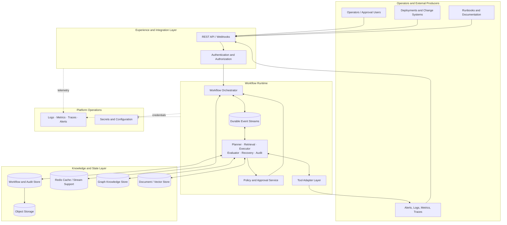
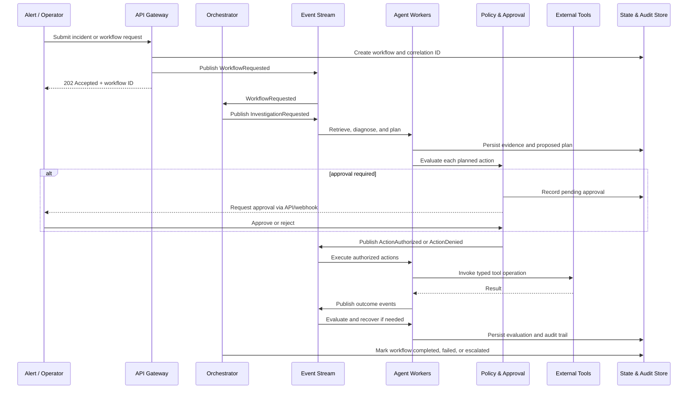
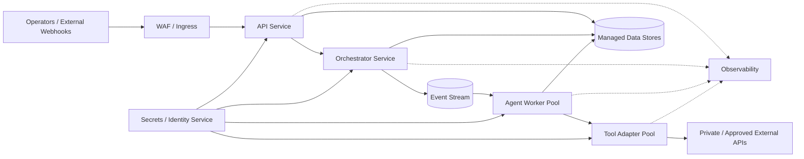

# High-Level Design: Autonomous AI Operations Platform

Version: 1.0  
Status: Design baseline

## 1. Executive Summary

The Autonomous AI Operations Platform is a production-oriented runtime for executing autonomous agent workflows safely and transparently. It is designed as a generic platform; its first demonstration workload is an AI Site Reliability Engineer (AI SRE) that consumes operational signals, diagnoses incidents, proposes or performs recovery, and produces an evaluation report and auditable record.

The design separates synchronous control-plane interactions from asynchronous workflow execution. An API layer accepts authenticated requests and exposes workflow state. A durable event backbone drives orchestration and decouples signal ingestion, reasoning, tool execution, evaluation, recovery, and notification. Specialized agents collaborate through explicit workflow state, policy gates, and a shared operational knowledge layer that includes GraphRAG.

This architecture prioritizes reliable execution over a conversational interface. Every consequential action is correlated to a workflow, governed by policy, observable end to end, and retained for audit. Human approval is a first-class control point for actions that exceed configured autonomy.

## 2. Design Goals

| Goal | Architectural response | Rationale |
| --- | --- | --- |
| Autonomous, distributed workflows | Event-driven orchestrator and independently scalable workers | Long-running reasoning and remediation must not block request handling or depend on one process. |
| Safe remediation | Policy decision point, approval gates, and constrained tool adapters | An agent may recommend actions, but it must not bypass operational controls. |
| Explainable decisions | Persisted plans, evidence, tool results, evaluation, and audit events | Operators need to understand what happened and why. |
| Operational knowledge retrieval | GraphRAG over service, dependency, incident, and documentation knowledge | Incident diagnosis depends on relationships as well as text similarity. |
| Reliability and recovery | Durable state, idempotent consumers, retries, DLQ, and recovery agent | Failures are expected in distributed systems and must be visible and recoverable. |
| Observability | Correlated logs, metrics, traces, and workflow telemetry | The platform itself must be diagnosable during an incident. |
| Extensibility | Stable event contracts, tool/agent interfaces, and pluggable integrations | New agents, models, tools, and domains should not require redesigning the runtime. |

The platform does not optimize for a frontend-heavy chatbot experience, model fine-tuning, or prompt engineering as primary products. User interfaces may consume the API, but the runtime and its control mechanisms remain the system of record.

## 3. Layered System Architecture

The layers isolate concerns. The edge layer is responsible for admission and status access; it does not execute long-running agent work. The runtime coordinates work and control decisions. The knowledge layer provides durable facts, artifacts, and retrieval context. The operations layer is cross-cutting and must be available to every component.

## 4. Component Responsibilities

| Component | Responsibilities | Key design boundary |
| --- | --- | --- |
| API and webhook gateway | Accept incidents, workflow requests, approvals, and integration callbacks; validate schema; return workflow identifiers and status. | Performs no agent reasoning or privileged remediation. |
| Identity and access control | Authenticate callers, authorize tenant/project and action access, and propagate identity context. | Separates caller identity from agent runtime identity. |
| Workflow orchestrator | Create workflow state, schedule stages, correlate events, manage timeouts, and transition terminal states. | Owns lifecycle state, not domain-specific diagnosis. |
| Event backbone | Durably transport commands, facts, and outcomes between producers and consumers. | Enables independent deployment and backpressure handling. |
| Planner agent | Transform an incident and retrieved context into an explicit, ordered investigation/remediation plan. | Produces a proposal, never an implicit execution mandate. |
| Retrieval and GraphRAG agents | Retrieve relevant documents and traverse service/dependency/incident relationships to produce evidence. | Returns grounded context with provenance. |
| Executor agent | Execute approved plan steps through typed tool adapters; record input, result, and side effects. | Cannot call external systems outside registered, authorized tools. |
| Evaluator agent | Assess diagnosis quality, plan outcome, tool results, and recovery success against defined criteria. | Separates assessment from the actor being assessed. |
| Recovery agent | Detect stalled or failed workflow stages, select retry/compensation/escalation paths, and coordinate re-entry. | Does not erase prior evidence or audit history. |
| Policy and approval service | Evaluate risk, permissions, environment constraints, and approval requirements; manage approval state. | Is the enforcement point before consequential action. |
| Audit service | Emit immutable, queryable records of decisions, approvals, tool actions, and state transitions. | Audit records are append-oriented and not agent-editable. |
| Tool adapter layer | Normalize access to observability, deployment, ticketing, and remediation systems; enforce timeouts and idempotency keys. | Shields agents from provider-specific APIs and credentials. |
| Observability subsystem | Collect logs, metrics, distributed traces, dashboards, and platform alerts. | Uses correlation identifiers across all layers. |

## 5. Request Lifecycle

An incident can originate from an alert, a user request, or an integration callback. The gateway authenticates the producer, validates the payload, creates a workflow record, and emits an intake event. From this point, the workflow is progressed asynchronously so that the caller is not held open while agents reason or wait for approval.

Each message carries a workflow ID, causation ID, correlation ID, actor identity, schema version, timestamp, and idempotency key. These identifiers allow events, traces, artifacts, and external calls to be reconstructed into one execution narrative.

## 6. Event-Driven Architecture

The event backbone is the system's coordination mechanism. Commands express requested work (for example, `InvestigationRequested`); domain events express completed facts (for example, `DiagnosisProduced` or `RemediationCompleted`). Consumers acknowledge only after durable handling, enabling at-least-once delivery with idempotent processing.

Typical event families include:

- Intake: `IncidentReceived`, `WorkflowRequested`, `SignalIngested`
- Reasoning: `ContextRetrieved`, `DiagnosisProduced`, `PlanProposed`
- Governance: `PolicyEvaluated`, `ApprovalRequested`, `ActionAuthorized`, `ActionDenied`
- Execution: `ToolInvocationRequested`, `ToolInvocationCompleted`, `RemediationCompleted`
- Assurance: `EvaluationCompleted`, `RecoveryRequested`, `WorkflowEscalated`, `WorkflowCompleted`
- Operations: `ConsumerRetryScheduled`, `MessageDeadLettered`, `AuditRecorded`

Ordering is required only within a workflow or action partition, not globally. This preserves causal sequencing for one incident while allowing unrelated incidents to execute concurrently. Producers use an outbox pattern: workflow state and the event-to-publish record are committed together, then relayed to the stream. This avoids losing an event after a successful state update.

Transient failures use bounded retries with exponential backoff and jitter. Messages that exhaust retry policy are retained in a dead-letter queue with their failure context. They are not silently discarded; the recovery path either reprocesses them safely, compensates, or escalates to an operator.

## 7. Data Flow

The AI SRE flow turns operational telemetry into governed action:

1. Signal adapters normalize logs, metrics, traces, alerts, and deployment history into an incident envelope.
2. The orchestrator creates durable workflow state and routes an investigation request.
3. Retrieval gathers relevant runbooks, prior incidents, and telemetry evidence. GraphRAG additionally resolves affected services, dependencies, owners, deployments, and known failure relationships.
4. The planner creates a diagnosis hypothesis and stepwise plan with evidence references and estimated action risk.
5. Policy evaluates each action. Low-risk actions may be automatically authorized under policy; higher-risk or production-impacting actions pause for human approval.
6. The executor invokes approved, typed tool operations and emits outcomes. Tool responses and produced artifacts are stored with provenance.
7. The evaluator verifies whether service health and success criteria improved. If not, the recovery agent retries safely, chooses a compensating path, or escalates with the complete context.
8. The orchestrator records a terminal workflow state and publishes notifications and evaluation results.

Raw, large, or immutable inputs such as log bundles and trace exports belong in object storage. Workflow records carry references and checksums rather than duplicating those artifacts in event payloads. This keeps messages small, avoids sensitive-data proliferation, and allows repeatable evidence review.

## 8. Storage Architecture

Storage is polyglot because workflow coordination, low-latency coordination, relationship traversal, and large artifact retention have different access patterns.

| Store | Primary data | Architectural rationale |
| --- | --- | --- |
| PostgreSQL | Workflow state, plans, approvals, policy outcomes, configuration, relational audit indexes | Strong transactional semantics support lifecycle transitions and the outbox pattern. |
| Redis / Redis Streams | Stream transport support, consumer coordination, caches, short-lived locks, rate limits | Low-latency ephemeral coordination and scalable event consumption. |
| Cosmos DB | Flexible, high-volume event or agent-memory documents where schema evolves | Accommodates heterogeneous operational context and scalable document access. |
| Neo4j | Service topology, dependencies, incidents, ownership, and knowledge relationships | Graph traversal improves root-cause context beyond keyword search. |
| Blob storage | Logs, traces, attachments, model artifacts, reports, and retained audit evidence | Cost-effective durable storage for large immutable objects. |

The logical design does not require a consumer to query every store. The orchestrator relies on authoritative workflow state; retrieval composes graph and document evidence; execution uses only the scoped data needed for a tool invocation. Data retention, residency, and deletion policies are applied per data class. Sensitive fields are minimized in events, encrypted at rest, and referenced through access-controlled artifact locations.

## 9. External Integrations

External systems are reached only through adapter contracts. An adapter exposes a stable operation, input/output schema, capabilities, timeout, retry classification, idempotency behavior, and required authorization scope. Agents select approved operations rather than issuing arbitrary provider API calls.

| Integration class | Examples of exchanged data | Controls |
| --- | --- | --- |
| Observability platforms | Metrics queries, logs, traces, alerts | Read-only-by-default scopes; query limits and redaction. |
| Deployment and infrastructure systems | Version history, rollout state, rollback or scaling actions | Environment allow-lists, change windows, approvals, idempotency keys. |
| Incident and collaboration systems | Tickets, notifications, escalation status | Signed webhooks, least-privilege service identities, delivery retry. |
| Knowledge sources | Runbooks, service catalogues, operational documentation | Ingestion validation, provenance, freshness metadata, access filtering. |
| Model providers | Prompts, retrieved context, structured agent outputs | Model routing, output validation, usage controls, and sensitive-data minimization. |

Adapter isolation allows a provider to be replaced without changing agent behavior. It also creates a single location to enforce schemas, secrets handling, telemetry, and circuit-breaking for unreliable providers.

## 10. Deployment Overview

The platform is deployed as independently scalable, stateless service and worker workloads around managed stateful services. A production deployment separates environments and uses private network paths for data stores and integrations wherever possible.

Containers provide reproducible packaging; an orchestrator such as Kubernetes is an appropriate target for worker scheduling, isolation, and autoscaling as the roadmap matures. Local and Docker-based deployments support development. CI/CD promotes immutable artifacts through environments, runs contract and security checks, and uses progressive rollout with rollback capability.

## 11. Scalability Strategy

The API, orchestrator, agents, and adapters scale horizontally because they are stateless between durable checkpoints. Event partitions are keyed by workflow or incident to retain local ordering while distributing unrelated work. Consumer groups allow specialized agents to scale independently based on queue depth, processing latency, and external-provider limits.

Compute-intensive retrieval, model inference, and execution workloads are isolated into separate worker pools with explicit concurrency limits. Backpressure propagates through queue depth, admission control, and rate limits rather than allowing an alert storm to exhaust downstream systems. Caches reduce repeat reads of stable service topology and documents; they do not become the source of truth. Storage is scaled by data type, with large artifacts offloaded to object storage and retention policies preventing unbounded hot-database growth.

## 12. Reliability Strategy

The runtime assumes partial failure. Durable workflow state, outbox-based publication, idempotent handlers, and idempotent external calls make retries safe. A workflow state machine prevents duplicate or stale events from moving a workflow backward. Timeouts, leases, heartbeats, and watchdogs identify stalled work.

Circuit breakers and bulkheads isolate failing integrations or model providers. Retryable errors are retried within bounded policy; non-retryable errors fail deterministically with actionable context. Dead-letter handling and the recovery agent ensure failed events are reviewed and routed to a known outcome. Critical data stores are backed up, restored regularly, and deployed with availability appropriate to their recovery objectives. Runbooks define service-level objectives for workflow completion, event lag, tool success rate, and recovery time.

## 13. Security Overview

Security follows a zero-trust and least-privilege model. Users, services, and agents have distinct identities; agent permissions are scoped to the workflow, environment, registered tool, and approved action. The policy service enforces authorization separately from model output, so a generated plan cannot grant itself capability.

Data is encrypted in transit and at rest. Secrets are retrieved at runtime from a managed secret store and never placed in prompts, event bodies, logs, or source control. Input schemas, tool parameters, and model outputs are validated; untrusted content from logs or documents is treated as data, not executable instruction. Sensitive operational data is redacted or minimized before model-provider transfer, subject to provider and residency policies.

Every access decision, approval, tool call, and state transition is auditable with actor identity and correlation context. Segmented networking, private endpoints, egress controls, dependency scanning, image signing, and regular access reviews complete the operational security posture.

## 14. Future Extensibility

The architecture is intentionally domain-neutral. The AI SRE is a reference workflow, while stable events, agent contracts, policy interfaces, and tool adapters enable additional autonomous domains such as security operations, data operations, or customer support operations.

Planned evolution can add multi-tenancy through tenant-aware identity, partitioning, quotas, and encryption boundaries; multi-region execution through regional event and data strategies; an agent SDK and plugin marketplace through versioned contracts and signed packages; Kubernetes-native remediation through additional adapters and policies; and model routing through a provider-agnostic model gateway. Adaptive planning can be introduced as a new planner capability while retaining the same policy, approval, evaluation, and audit boundaries.

These extensions should preserve three invariants: workflow state remains durable, every side effect remains policy-governed, and every decision remains observable and auditable.
