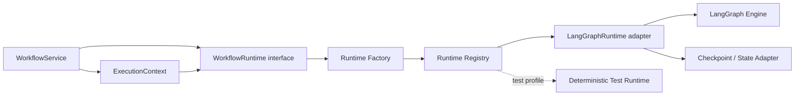
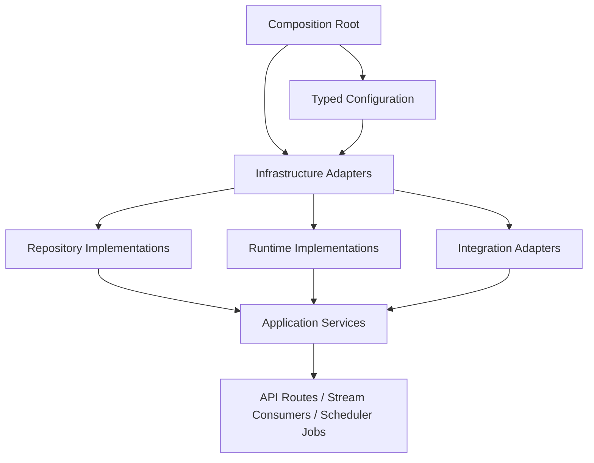
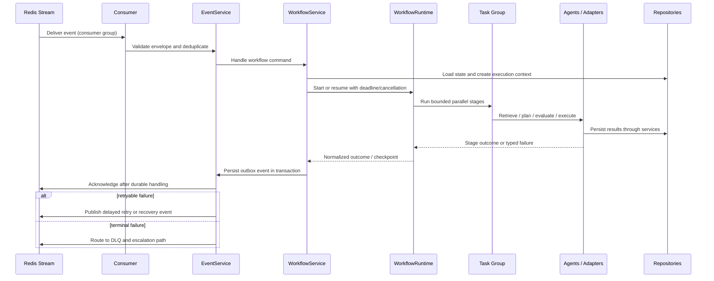

# Low-Level Design: Backend Architecture

Version: 1.0  
Status: Design baseline

## Purpose and Design Principles

This document defines the internal backend design for the Autonomous AI Operations Platform. It turns the high-level event-driven architecture into modular boundaries, dependency rules, and execution contracts suitable for a production Python backend. The primary workload is an AI SRE workflow, but the design remains domain-neutral so additional autonomous workflows can use the same runtime.

The design is async-first, event-driven, and stateless at service boundaries. Durable stores hold workflow truth; Redis Streams distributes work; services own business use cases; repositories isolate persistence; and agents collaborate through explicit contracts rather than direct storage access. The system uses dependency injection instead of global objects so components are testable, replaceable, and safe to run in multiple processes.

## 1. Module Breakdown

The following logical package layout keeps framework, infrastructure, and business concerns separate. A module may contain subpackages as it grows, but ownership and allowed dependencies remain stable.

```text
backend/
├── api/             # HTTP, webhook, and API boundary
├── core/            # Shared domain primitives and application contracts
├── config/          # Settings, environment resolution, and secret providers
├── events/          # Event contracts, publishing, consumption, and outbox relay
├── scheduler/       # Scheduled work, watchdogs, and deferred execution
├── workflows/       # Declarative workflow definitions and state transitions
├── runtime/         # Framework-neutral workflow runtime abstraction and adapters
├── agents/          # Specialized reasoning and action collaborators
├── retrieval/       # GraphRAG, document retrieval, ranking, and provenance
├── memory/          # Scoped working, episodic, and long-term memory lifecycle
├── services/        # Application use cases and orchestration services
├── evaluation/      # Evaluation criteria, scoring, and report generation
├── observability/   # Structured logging, metrics, tracing, and telemetry adapters
├── recovery/        # Retry/compensation/escalation decision logic
├── policies/        # Authorization, risk, approval, and policy decisions
├── cache/           # Cache abstraction, keys, invalidation, and rate/lock support
├── db/              # Database sessions, repositories, migrations, and persistence adapters
├── models/          # Domain entities, value objects, and persistence mappings
├── schemas/         # Versioned API, event, and integration data contracts
└── utils/           # Small dependency-free helpers
```

| Module | Responsibility | Why it exists / key boundary |
| --- | --- | --- |
| `api` | FastAPI routes, request authentication context, request/response conversion, webhooks, and background-task hand-off. | Keeps transport concerns out of business logic. Routes validate and delegate; they do not orchestrate workflows or access stores. |
| `core` | Cross-cutting domain primitives, identifiers, result types, base exceptions, protocol definitions, and execution context contracts. | Provides a small stable vocabulary shared by layers without becoming a miscellaneous dependency bucket. |
| `config` | Typed settings, environment profiles, configuration loading, secret-provider interfaces, and feature flags. | Centralizes configuration precedence and prevents environment reads throughout application code. |
| `events` | Versioned event envelopes, publishers, Redis Stream consumers, consumer-group coordination, outbox relay, retry metadata, and DLQ routing. | Makes asynchronous communication durable and consistent while hiding stream-provider details. |
| `scheduler` | Periodic jobs, delayed retries, workflow deadline scans, lease/watchdog checks, and maintenance schedules. | Time-based work must be explicit and observable instead of hidden in request processes. |
| `workflows` | Workflow definitions, state machine rules, stage contracts, transition validation, and workflow-specific composition. | Separates what the business process is from the engine that executes it. |
| `runtime` | `WorkflowRuntime` interface, `LangGraphRuntime` adapter, runtime registry, factory, execution context, checkpoint contract, and runtime lifecycle. | Prevents business logic from depending directly on LangGraph and permits controlled engine replacement or multiple runtimes. |
| `agents` | Planner, retrieval, executor, evaluator, recovery, audit, and tool-facing agent collaboration contracts. | Encapsulates specialized reasoning while requiring services, policies, and adapters for state and side effects. |
| `retrieval` | Document ingestion/query contracts, GraphRAG traversal, ranking, context assembly, provenance, and freshness checks. | Grounds reasoning in traceable evidence rather than coupling agents to database queries. |
| `memory` | Workflow-scoped working memory, episodic summaries, long-term memory policies, retrieval, retention, and redaction. | Makes memory bounded, attributable, and governed rather than an uncontrolled agent cache. |
| `services` | Application services that implement use cases, coordinate dependencies, enforce transaction boundaries, and publish outcomes. | Establishes one place for business orchestration independent of HTTP, streams, agents, or databases. |
| `evaluation` | Evaluation definitions, evidence collection, deterministic/LLM-assisted scorers, score aggregation, and report models. | Allows agent outcomes to be assessed independently and consistently. |
| `observability` | Correlation propagation, structured logging, OpenTelemetry instrumentation, metrics, trace export, dashboards, and alert hooks. | Ensures every execution is diagnosable without coupling business modules to telemetry vendors. |
| `recovery` | Failure classification, retry/compensation planning, escalation rules, recovery event handling, and stalled-workflow detection. | Treats recovery as a first-class workflow capability rather than scattered exception handling. |
| `policies` | Policy definitions, risk classification, authorization decisions, approval requirements, and decision records. | Ensures model output cannot bypass governance or directly authorize side effects. |
| `cache` | Cache provider abstraction, namespaced keys, TTL/invalidation policy, distributed locks, idempotency records, and rate-limit primitives. | Keeps Redis-as-cache use explicit and prevents ephemeral data becoming a source of truth. |
| `db` | Database connection/session management, repository implementations, transaction/outbox support, and migrations. | Isolates physical storage and lifecycle from domain services. |
| `models` | Domain entities such as workflow, plan, action, approval, event record, evaluation, and audit record; persistence mappings remain adapter-facing. | Gives business concepts stable representations without exposing transport schemas as domain state. |
| `schemas` | Pydantic request/response, event, tool, provider, and persisted-document schemas with versions and validation rules. | Protects module boundaries and enables compatibility testing for integrations. |
| `utils` | Narrow, pure helpers such as time, hashing, serialization, and retry calculations. | Avoids duplicated low-level logic; it must not contain business decisions or import higher layers. |

## 2. Runtime Abstraction

### 2.1 Internal Contract

`WorkflowRuntime` is the internal interface through which services start, resume, inspect, cancel, and terminate workflow executions. Its contract accepts a declarative workflow definition plus an `ExecutionContext`, returns a runtime-neutral execution handle or outcome, and exposes lifecycle operations such as checkpointing and cancellation. The context contains only explicit execution inputs: workflow/execution/correlation identifiers, actor and tenant scope, deadlines, cancellation token, approved capabilities, configuration snapshot, and telemetry context.

The interface is deliberately owned by `runtime`, not by `workflows` or `agents`. `workflows` defines the process and valid state transitions; `runtime` executes that process; services decide when to invoke it. No service, agent, policy, or API module imports LangGraph types.

### 2.2 Why the Abstraction Exists

Direct dependency on LangGraph would leak framework graph objects, checkpoint rules, callbacks, and errors into business logic. That would make workflow tests require a framework, bind recovery behavior to an engine implementation, and make future migration risky. The abstraction supplies four benefits:

- **Portability:** a different graph engine, a deterministic test runtime, or a remote workflow service can satisfy the same contract.
- **Testability:** services and workflow definitions can be tested with a fake runtime that produces controlled outcomes.
- **Governance:** runtime entry/exit becomes one enforceable point for context propagation, telemetry, deadlines, checkpoints, and cancellation.
- **Operational safety:** engine-specific failures are translated into platform exceptions and recovery events rather than escaping across layers.

### 2.3 LangGraph as an Adapter

`LangGraphRuntime` is one infrastructure implementation of `WorkflowRuntime`. It translates a platform workflow definition into a LangGraph graph, maps the platform `ExecutionContext` into graph invocation/checkpoint metadata, invokes or resumes the graph asynchronously, and normalizes graph results, interrupts, and failures back into runtime-neutral outcomes. It must not contain product policy, repository calls, or API logic.

The runtime registry maps a named runtime capability to a registered implementation. The runtime factory resolves the implementation from typed configuration and validates that it supports the requested workflow capability. This allows a default LangGraph runtime now, a deterministic in-process runtime for tests, and an alternate provider later without conditional framework logic in services.



## 3. Service Layer

Services implement application use cases and compose repositories, runtime, events, policies, and integration ports. They are the only layer permitted to coordinate a multi-repository transaction and publish a resulting domain event through the outbox. They are transport-agnostic: API handlers and event consumers invoke the same service methods.

| Service | Core responsibilities | Primary dependencies |
| --- | --- | --- |
| `WorkflowService` | Create, validate, start, resume, pause, cancel, and complete workflows; own state transitions and execution lifecycle. | Workflow repository, runtime factory, event service, policy service, audit repository, observability service. |
| `EventService` | Validate/envelope events; persist outbox records; publish, consume, acknowledge, schedule retry, and route DLQ messages. | Event repository, stream adapter, schema registry, observability service, recovery service. |
| `RetrievalService` | Build evidence requests, query document and graph sources, rank/merge context, apply access filtering, and return provenance. | Graph repository, document/vector port, cache, configuration service, observability service. |
| `EvaluationService` | Initiate evaluation, collect workflow evidence, run scorers, persist results, determine quality gates, and produce evaluation reports. | Evaluation repository, retrieval service, configuration service, event service, observability service. |
| `RecoveryService` | Classify failures, decide retry/compensation/escalation, record recovery attempt, and emit recovery events. | Workflow repository, event service, policy service, runtime, configuration service, audit repository. |
| `MemoryService` | Read/write scoped memory, create summaries, enforce retention/redaction, and expose provenance-aware recall. | Memory store port/repository, cache, policy service, audit repository. |
| `PolicyService` | Evaluate action risk, authorization, environment constraints, approval state, and policy versions; return a durable decision. | Configuration service, policy repository/port, audit repository, event service. |
| `ObservabilityService` | Create/propagate correlation context; emit structured logs, metrics, traces, and domain telemetry. | Observability adapters, configuration service. |
| `NotificationService` | Deliver workflow state, approval requests, escalation, and completion notifications through supported channels. | Notification adapters, configuration service, event service, audit repository. |
| `ConfigurationService` | Resolve typed runtime settings, feature flags, model/integration policy, and dynamic configuration snapshots. | Config providers, configuration repository, cache, secret-provider interface. |
| `AuditService` | Record immutable actor decisions, policy outcomes, tool calls, and lifecycle transitions; support audit queries. | Audit repository, event service, observability service. |

Service dependencies are expressed as interfaces (ports), supplied by dependency injection. For example, `WorkflowService` depends on a runtime factory and repository protocols, not on `LangGraphRuntime`, SQLAlchemy, or Redis classes. This protects use cases from infrastructure churn and keeps dependency direction inward.

## 4. Repository Layer

Repositories are persistence adapters that implement collection-oriented access to a single aggregate or storage concern. They map between domain models and physical records, encapsulate queries and transactions, and expose no business workflow decisions. A repository may use PostgreSQL, Neo4j, Cosmos DB, object storage, or a provider adapter, but callers receive domain-oriented results.

| Repository | Responsibility | Storage isolation benefit |
| --- | --- | --- |
| `WorkflowRepository` | Persist and retrieve workflow aggregate state, execution metadata, plans, actions, approvals references, state versions, and checkpoints. | Allows workflow storage/locking strategy to change without rewriting lifecycle services. |
| `EventRepository` | Store outbox events, processed-event/idempotency records, delivery attempts, retry schedules, and DLQ references. | Preserves reliable publication and consumer deduplication independently of the stream provider. |
| `GraphRepository` | Query and update service topology, dependencies, ownership, incident relationships, and GraphRAG traversal results. | Shields retrieval logic from Neo4j query language and graph schema evolution. |
| `AuditRepository` | Append and query immutable audit entries with actor, causation, correlation, timestamp, and evidence references. | Makes retention, integrity controls, and audit indexing replaceable and centrally enforced. |
| `EvaluationRepository` | Persist evaluation definitions, score components, reports, evaluator version, and comparison history. | Decouples evaluation logic from relational/document storage choices. |
| `ConfigurationRepository` | Read/write versioned non-secret configuration, feature flags, policy references, and environment overrides. | Prevents services from reading files or environment variables directly. |

Additional narrow repositories may be introduced for memory, documents, tool execution records, or notifications when their aggregate needs independent persistence semantics. Repositories never publish events, call external APIs, invoke agents, or decide what a workflow should do. Those are service responsibilities.

## 5. Dependency Injection

The application uses explicit constructor injection and a composition root. At startup, the composition root builds typed settings, connection pools, provider clients, repositories, adapters, services, runtime implementations, and route/consumer handlers. It owns startup and shutdown lifecycles, including connection cleanup and consumer registration.

Dependencies are supplied as protocols/interfaces at module boundaries. A production composition selects PostgreSQL, Redis Streams, Neo4j, Azure services, LangGraph, OpenTelemetry, and notification implementations. Test compositions substitute in-memory or contract-test adapters. Request- and execution-scoped objects, such as `ExecutionContext`, database sessions, trace spans, and cancellation tokens, are created per operation and never retained in global mutable state.

This design avoids hidden configuration, shared mutable clients, and order-dependent tests. It also permits multiple worker processes to have independent safe lifecycles while operating against the same durable state.



## 6. Async Execution Model

All I/O-facing contracts are asynchronous. Async execution prevents an API request, stream consumer, or one slow integration from blocking unrelated workflows. CPU-intensive or blocking libraries are isolated into bounded worker execution rather than called on the event loop.

| Mechanism | Design use | Why it is needed |
| --- | --- | --- |
| `asyncio` | Base concurrency model for API calls, repositories, stream I/O, model/integration adapters, and orchestration. | Supports high concurrency with controlled resource use. |
| Task Groups | Run bounded, related work such as parallel evidence retrieval under one parent lifecycle. | Failure and cancellation propagate predictably; orphan work is avoided. |
| Background tasks | Only short, non-critical post-response work such as notification hand-off or telemetry flush. | Durable workflow execution must go to streams/runtime, not an HTTP process that can terminate. |
| Redis Streams | Durable commands/events, consumer groups, pending-entry recovery, and work distribution. | Decouples producers/consumers and supports horizontal workers with at-least-once delivery. |
| Cancellation | Execution context carries cancellation/deadline state; runtime and adapters check it at safe boundaries. | Operators must be able to stop work, especially before a side effect. |
| Timeouts | Explicit deadline budgets at request, workflow-stage, model, tool, and database boundaries. | Prevents resource exhaustion and turns hangs into recoverable outcomes. |
| Retries | Retry only classified transient errors using bounded exponential backoff and jitter; require idempotency. | Increases resilience without duplicating remediation actions. |
| Semaphores | Per-provider, per-tenant, and per-worker concurrency limits, especially for models and external tools. | Protects dependencies and prevents a noisy workflow from monopolizing capacity. |
| Backpressure | Queue-depth admission control, bounded in-flight tasks, rate limits, and deferred scheduling. | Ensures alert storms degrade in a controlled, observable way. |

### Runtime Execution Flow



Consumer acknowledgement occurs only after the idempotency record and resulting state/outbox write are durable. A cancellation request follows the same durable-control path: it updates workflow state, emits a cancellation event, signals the execution context, and lets the runtime compensate or stop at a safe boundary. It never assumes that an in-flight external side effect can be undone without an explicit compensation action.

## 7. Module Dependency Rules

Dependencies point from delivery mechanisms toward application and infrastructure abstractions, never in reverse. The permitted default path is:

```text
API / Stream Consumer / Scheduler
            ↓
         Services
            ↓
  Repositories / Runtime / Ports
            ↓
 Database / Streams / External Providers
```

`core`, `models`, and `schemas` may be shared downward-facing contracts, while `utils` remains dependency-free. `observability` and `config` are cross-cutting provider ports that may be injected into higher layers; they must not invoke workflows as a side effect.

| Module | Allowed dependencies | Prohibited dependencies |
| --- | --- | --- |
| `api` | schemas, services, core, observability | repositories, database clients, agents, runtime implementations |
| `events`, `scheduler` | schemas, services, core, observability, configuration | API routes, domain-specific storage queries |
| `workflows` | core, models, schemas, agent/service contracts | LangGraph types, API, database clients |
| `runtime` | workflow definitions, core, schemas, observability, runtime adapters | API, repositories, policy decisions, domain service logic |
| `agents` | core/models/schemas, service interfaces, retrieval/memory/policy contracts | repositories/database clients, API routes, direct unmanaged external calls |
| `services` | repositories, runtime interface, events, policies, agents, cache, observability, config | API framework types, concrete database/stream/framework types |
| `repositories` | models, schemas, database/graph/cache adapters, core | services, agents, policies, API, workflow decisions |
| `policies` | models, schemas, configuration/repository contracts, audit/event service contracts | API routes, tool adapters, runtime invocation |
| `db`, `cache`, provider adapters | models/schemas/core/config | services, workflows, agents, API |

In particular, agents never access databases directly; policies never call APIs or tools; repositories do not contain business logic; and API routes never construct services or perform stateful orchestration. These restrictions prevent circular imports, inconsistent authorization, and untestable hidden coupling.

## 8. Error Handling Strategy

Errors are typed, classified, and converted at boundaries. Low-level provider exceptions are translated to platform exceptions before reaching services; services decide the business outcome; the event/recovery path decides retry, compensation, DLQ, or escalation.

| Area | Strategy | Rationale |
| --- | --- | --- |
| Custom exceptions | Define stable categories: validation, authorization/policy denial, not found, conflict, transient dependency, timeout, cancellation, permanent integration, runtime, and recovery failure. | Callers can make correct decisions without parsing provider-specific error text. |
| Retry policy | Retry only transient, idempotent operations with maximum attempts, exponential backoff, jitter, deadline awareness, and telemetry. | Prevents retry storms and duplicate side effects. |
| Circuit breakers | Apply per external provider/operation with closed, open, and half-open states. | Failing dependencies are isolated so healthy workflows can continue or degrade. |
| Fallbacks | Use defined safe alternatives: cached/stale read context with provenance, alternate model/provider, read-only diagnosis, or human escalation. | Degradation must not silently lower safety or invent evidence. |
| Dead-letter queue | Capture exhausted/unprocessable messages, original envelope, error class, attempt history, and correlation context. | Preserves evidence and makes failures operationally actionable. |
| Recovery events | Emit durable `RecoveryRequested`, `RetryScheduled`, `CompensationRequested`, or `WorkflowEscalated` events. | Converts failures into explicit, auditable workflow behavior. |

No exception is silently swallowed. Errors are logged once with structured correlation fields and recorded at the appropriate workflow/action level without exposing secrets. Idempotency records and workflow transition checks protect against duplicate delivery; compensation is explicit because a retry cannot guarantee reversal of a completed external side effect.

## 9. Configuration

Configuration is typed, validated at startup, immutable for a single execution, and separated from secrets. Resolution precedence is: safe code defaults, environment-specific non-secret configuration, approved dynamic configuration, then environment-variable overrides where permitted. Every execution stores or references the effective configuration and policy version used for auditability and reproducibility.

| Context | Configuration approach | Secret handling |
| --- | --- | --- |
| Environment variables | Supply deployment identity, environment name, endpoint references, feature switches, and non-secret overrides. | Never place credentials or raw connection strings in logs, events, or committed files. |
| Secret provider | Resolve provider credentials, signing keys, certificates, and database secrets at runtime through an injected interface. | Use managed identity/short-lived credentials where possible; rotate without code changes. |
| Azure | Use Azure Key Vault for secrets and managed identity for workload-to-service authentication; configure Cosmos DB and Blob Storage through endpoint references and identity. | Avoid account keys in application configuration; apply private endpoints and least-privilege roles. |
| Development | Local `.env`-style values may provide non-production settings and local emulators; use explicit development profile. | Development secrets remain local and are never promoted or committed. |
| Production | Deployment-managed configuration, validated startup checks, restricted overrides, feature-flag audit, and safe failure on missing critical settings. | Production secret access is identity- and network-scoped with rotation and access audit. |

Configuration service reads through typed providers rather than letting modules inspect environment variables directly. This makes values testable, documents ownership, and avoids contradictory configuration across workers.

## 10. Testing Strategy

Testing validates module contracts, workflow behavior, and production failure modes. Tests are run in CI with deterministic fixtures, redacted representative operational data, and isolated external dependencies.

| Test type | Scope | Why it matters |
| --- | --- | --- |
| Unit tests | Domain models, policy rules, service decisions, retry classification, state transitions, agents with fake ports, and utility functions. | Fast verification of business behavior without infrastructure. |
| Integration tests | Repositories, migrations, Redis Streams, outbox relay, cache semantics, graph queries, and service composition against disposable real services. | Verifies storage and asynchronous behavior that mocks cannot prove. |
| Contract tests | API schemas, event versions, runtime interface, tool adapters, notification webhooks, and provider ports. | Prevents independently deployed modules and integrations from drifting. |
| Workflow tests | Happy path, approval pause/resume, cancellation, duplicate delivery, recovery, compensation, and terminal-state scenarios using a deterministic runtime. | Validates that state machines and cross-service interactions meet operational requirements. |
| Load tests | Alert bursts, concurrent workflows, queue backlog, model/tool saturation, and cache behavior under defined SLOs. | Confirms backpressure and scaling controls before an incident creates load. |
| Chaos tests | Kill workers, delay/drop events, make stores unavailable, exhaust provider quotas, inject timeouts, and simulate duplicate messages. | Demonstrates recovery, idempotency, and graceful degradation under partial failure. |

Production-aligned test suites must assert correlation propagation, audit completeness, policy enforcement before side effects, and absence of secret leakage in logs/events. Database migrations, schema compatibility, and dependency-injection wiring are included in release validation.

## Architectural Outcome

This design maintains a strict separation of concerns: the API admits work, services own use cases, repositories own persistence, the runtime owns engine execution, and agents supply specialized capabilities through governed interfaces. The additional `runtime` module is the central safeguard against framework coupling: LangGraph is a replaceable adapter, not the platform's business architecture. Together with durable events, explicit recovery, injection-based composition, and enforced dependency rules, this provides a modular backend suitable for reliable autonomous operations.
