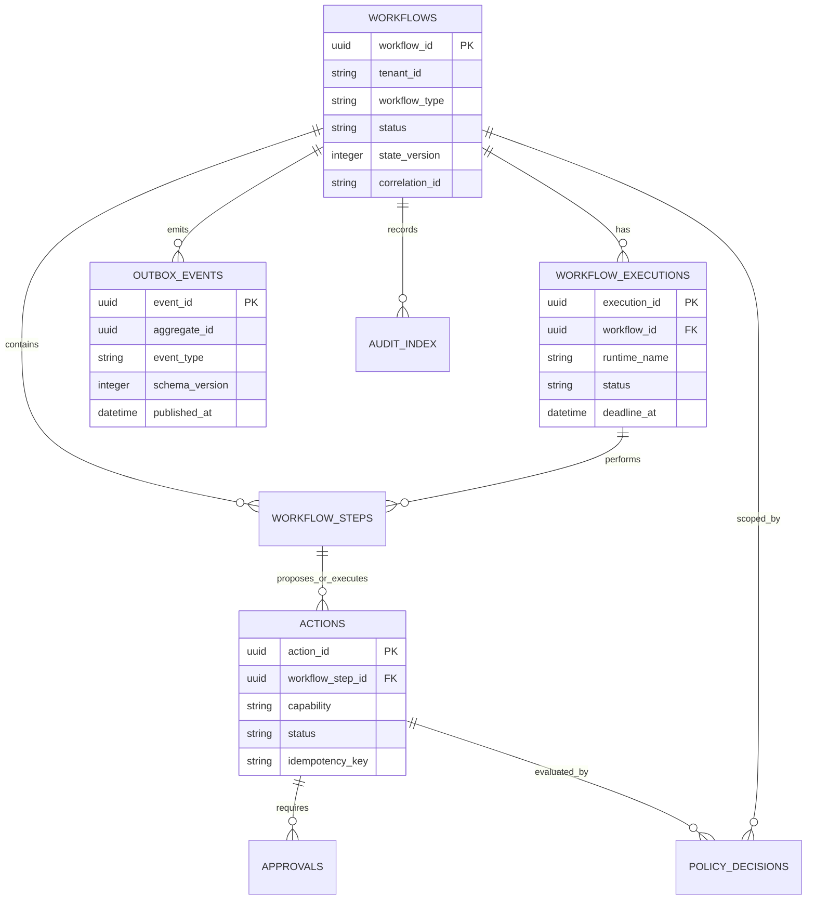
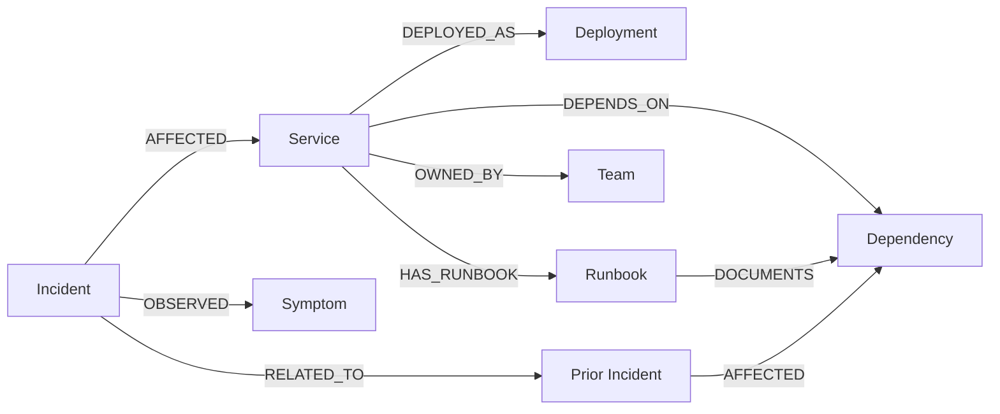
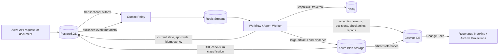

# Database Design: Autonomous AI Operations Platform

Version: 1.0  
Status: Design baseline

## Overview: Why the Platform Uses Multiple Databases

The platform uses polyglot persistence because its operational data has incompatible access, consistency, and retention requirements. A single database would force transactional workflow state, high-throughput event documents, graph traversal, ephemeral coordination, and large immutable artifacts into one compromise.

| Store | System-of-record role | Chosen for |
| --- | --- | --- |
| PostgreSQL | Transactional workflow control state and relational configuration | ACID transactions, constraints, state transitions, and outbox consistency. |
| Redis | Ephemeral coordination and event transport support | Low-latency streams, consumer groups, locks, cache, and rate limiting. |
| Azure Cosmos DB | High-volume, schema-flexible execution history and document-oriented operational records | Horizontally partitioned writes, per-partition ordered event history, and flexible agent/evaluation documents. |
| Neo4j | Operational knowledge graph | Relationship-first queries for GraphRAG and blast-radius analysis. |
| Azure Blob Storage | Large, immutable, or low-cost artifacts | Durable economical storage for documents, telemetry bundles, and generated artifacts. |

No store is an implicit replica of every other. PostgreSQL is authoritative for the current workflow control state and transactional outbox. Cosmos DB is the authoritative document/event history where flexible, high-volume records are required. Neo4j is authoritative for graph relationships. Blob storage is authoritative for immutable artifact bytes. Redis is never an authoritative record of business state. Cross-store references use stable IDs, tenant scope, checksum/version, and provenance rather than copying large payloads.

All stores use managed identity or workload identity, private network paths where available, encryption in transit and at rest, least-privilege access, and structured audit/telemetry. Repositories own access to a store; agents do not query stores directly.

## 1. PostgreSQL

### Purpose

PostgreSQL stores transactional control-plane data: the workflow aggregate and its current lifecycle state, plans and actions that must satisfy relational integrity, approvals and policy decisions, idempotency records, the transactional outbox, configuration metadata, and relational audit indexes. It provides the atomic write boundary required when a workflow transition must be committed together with an event that will later be published.

It is not the primary store for raw logs, full prompts, trace bundles, or unbounded event histories. Those payloads are retained in Blob Storage or Cosmos DB and referenced from PostgreSQL.

### Core Tables

| Table | Purpose | Important fields and constraints |
| --- | --- | --- |
| `workflows` | Current workflow aggregate and lifecycle state. | `workflow_id` PK; `tenant_id`; type; status; state version; correlation ID; timestamps; configuration/policy version; optimistic concurrency version. |
| `workflow_executions` | A start/resume attempt of a workflow. | `execution_id` PK; workflow FK; runtime name/version; status; deadline; checkpoint reference; start/end timestamps. |
| `workflow_steps` | Ordered or logically named plan/execution steps. | Step PK; workflow/execution FK; step type; status; attempt count; idempotency key; input/output artifact references. |
| `actions` | Governed proposed or executed remediation actions. | Action PK; workflow/step FK; capability; risk; status; tool operation; idempotency key; result reference. |
| `approvals` | Human approval decisions. | Approval PK; action FK; requester/approver identity; decision; expiry; decision timestamp; immutable decision rationale. |
| `policy_decisions` | Versioned authorization and risk evaluation outcome. | Decision PK; workflow/action FK; policy version; allow/deny/approval-required result; reason; evaluated timestamp. |
| `outbox_events` | Events committed with domain state and awaiting publication. | Event ID PK; aggregate ID; event type/version; envelope; created/published timestamps; publish attempt count; uniqueness on idempotency key. |
| `processed_events` | Consumer idempotency ledger. | Consumer name plus event ID as unique key; processed timestamp; outcome reference. |
| `config_versions` | Versioned, non-secret platform and workflow configuration metadata. | Config key/version; scope; effective interval; checksum; status. |
| `audit_index` | Query-oriented index of audit events whose detailed body may reside in Cosmos DB/Blob Storage. | Audit ID; actor; workflow/action IDs; event type; timestamp; detailed-record URI and integrity hash. |

### Relationships

Foreign keys protect relationships inside the transactional store. State transitions use optimistic concurrency (`state_version`) or a scoped row lock, so duplicate delivery or concurrent workers cannot both advance the same workflow. Append-oriented audit records are never changed to rewrite history; corrections create a linked record.

### Indexes

Indexes serve known operational access patterns and are reviewed from production query telemetry. Baseline indexes include:

- `workflows (tenant_id, status, updated_at DESC)` for operator queues and stalled-workflow scans.
- Unique `workflows (tenant_id, correlation_id)` where one incoming correlation maps to one workflow type.
- `workflow_executions (workflow_id, started_at DESC)` and `(status, deadline_at)` for execution history and timeout watchdogs.
- `workflow_steps (workflow_id, status, sequence)` and unique idempotency indexes for safe step execution.
- `actions (workflow_id, status, created_at DESC)` plus `(idempotency_key)` for action lookup and duplicate protection.
- `approvals (status, expires_at)` for approval expiry scans.
- `outbox_events (published_at, created_at)` filtered to unpublished rows, and a unique producer/idempotency key.
- `processed_events (consumer_name, event_id)` as the deduplication constraint.
- `audit_index (tenant_id, workflow_id, occurred_at DESC)` and `(actor_id, occurred_at DESC)` for incident and compliance investigation.

Indexes must include tenant scope where multi-tenancy is enabled. Partial and covering indexes should be selected only after observing workload shape; indiscriminate indexing slows write-heavy workflow execution.

### Transactions

PostgreSQL provides the boundary for a state transition, its audit index entry, idempotency update, and the corresponding outbox event. A service performs all of these in one short transaction. A separate outbox relay publishes committed events to Redis Streams and marks the record published only after broker acknowledgement. This avoids the dual-write failure where state changes but no event is emitted.

Transactions are kept short: agents, model calls, tool calls, graph traversal, and Blob uploads occur outside database transactions. External side effects use an idempotency key and durable action state; they are not made part of a distributed transaction. Where a failure follows an external action, the workflow records the observed outcome and invokes explicit compensation or recovery.

## 2. Redis

### Role and Durability Boundary

Redis supplies low-latency, disposable coordination. Redis Streams carries asynchronous work after the PostgreSQL outbox relay publishes it. Redis may persist according to its deployment configuration, but application correctness must not depend on it as the sole record of a workflow, action, approval, or audit event. Durable source records exist before a stream message is acknowledged.

| Capability | Design | Rationale |
| --- | --- | --- |
| Streams | Separate versioned streams for commands, domain events, retries, recovery, and dead letters; consumer groups per worker role; message IDs retained with workflow/correlation/idempotency metadata. | Provides work distribution, at-least-once delivery, pending-entry visibility, and local ordering by workflow partition. |
| Pub/Sub | Best-effort, non-durable fan-out for live UI updates, cache invalidation hints, and ephemeral telemetry notifications. | It is not used for business commands because disconnected subscribers would lose messages. |
| Distributed locks | Short leased locks with ownership token and fenced operation/state version; only for small coordination windows such as singleton maintenance or cache fill. | Prevents concurrent coordination without treating a lock as workflow state or holding it across I/O. |
| Caching | Namespaced, versioned keys for safe read-through data such as service topology snapshots, document metadata, and configuration; TTL, size limits, and explicit invalidation. | Reduces store load without allowing stale cache data to authorize a side effect. |
| Rate limiting | Token bucket/sliding-window keys scoped by tenant, actor, tool/provider, and worker pool. | Enforces fairness and protects models/external integrations during alert bursts. |
| Session storage | Short-lived API/session or signed-session revocation state when required; TTL aligned with identity expiry. | Keeps sessions expirable and independent from durable workflow identity. |
| Dead-letter queue | Dedicated streams store failed envelope, original stream/message ID, failure class, attempt history, and routing timestamp. | Enables investigation/replay without silently dropping events. |
| Retry queue | Delayed retry records keyed by next-attempt time; scheduler moves due records back to the command stream. | Provides bounded backoff without blocking consumers or sleeping workers. |

### Stream Processing Rules

Producers put only schema-versioned envelopes and small payloads in streams; large artifacts are Blob references. Consumers validate the envelope, claim pending messages only after the configured idle period, use `processed_events` to deduplicate, make their state/outbox transaction durable, then acknowledge. Retryable errors are scheduled with exponential backoff and jitter; exhausted or invalid messages go to the DLQ and emit recovery/escalation events.

Redis key names use a consistent namespace such as environment, tenant, capability, and schema/version. All ephemeral keys have a TTL except a deliberate stream retention policy. Memory limits, eviction policy, stream trim policy, pending-entry monitoring, and consumer lag alerts are mandatory operational settings.

## 3. Azure Cosmos DB

### Purpose and Document Families

Cosmos DB stores high-volume, append-oriented, and shape-evolving operational documents. It complements—not replaces—PostgreSQL's transactional current-state aggregate. A Cosmos execution document carries the complete historical timeline or materialized snapshot for an execution, while PostgreSQL remains the authority for the latest lifecycle transition and outbox emission.

| Document family | Content | Access pattern |
| --- | --- | --- |
| Workflow executions | Execution timeline, runtime metadata, stage outputs, checkpoint references, and summarized state. | Read by workflow/execution during resume, investigation, and report rendering. |
| Event sourcing records | Immutable domain event envelope plus causation/correlation, payload reference, schema version, and sequence. | Append and replay per workflow/execution; build materialized views asynchronously. |
| Audit logs | Detailed actor/action/policy/tool decision record, redacted context, and evidence pointers. | Query by tenant, workflow, actor, time, or compliance export. |
| Agent decisions | Planner hypotheses, retrieval evidence references, model/version metadata, structured output, confidence, and rationale. | Read per workflow or evaluation; support explanation and comparison. |
| Evaluation reports | Criteria, score components, evaluator version, evidence links, and final report. | Read per workflow, evaluation type, or trend pipeline. |
| Checkpoint snapshots | Serializable runtime-neutral snapshot, checkpoint sequence, parent checkpoint, integrity hash, and expiry/retention class. | Point read for resume and recovery; retain according to workflow policy. |

### Partition Key Strategy

The default partition key is a stable tenant-workflow scope, represented conceptually as `/tenantWorkflowKey` derived from `tenant_id` and `workflow_id`. All high-churn documents for one workflow—its events, decisions, evaluation reports, and checkpoints—share that key. This permits efficient point reads, ordered per-workflow event queries, and transactional batch operations within the one partition while avoiding cross-tenant access.

For workloads where a single tenant/workflow could exceed partition throughput or storage limits, event documents use a controlled execution segment suffix (for example, an execution or time-bucket segment) while retaining `workflow_id` as a queryable attribute. The segmentation rule must be deterministic and stored in the workflow metadata; it cannot be changed ad hoc during an incident. Tenant-wide operational dashboards use purpose-built projections or analytical export instead of unbounded cross-partition queries.

Document IDs are deterministic where idempotency is required, such as `event:{event_id}`, `checkpoint:{execution_id}:{sequence}`, or `decision:{action_id}:{policy_version}`. This makes duplicate writes detectable and preserves replay safety.

### Consistency Model

The default is session consistency: a service that writes a document can immediately read its own write while retaining scalable, low-latency operation. Within one logical partition, transactional batch is used for related append/update operations that must remain consistent. Strong consistency is reserved for a narrowly justified read path because it increases latency and cost; cross-partition business correctness is never built on assuming globally strong reads.

PostgreSQL remains the serialization point for workflow control decisions. Cosmos DB materialization is resilient to replay and may be temporarily behind the control-plane state. Documents include sequence numbers, event IDs, schema versions, timestamps, and integrity hashes so readers can detect lag or rebuild projections. Change Feed drives downstream indexing, reporting, and archival without polling the full container.

## 4. Neo4j

### GraphRAG Schema

Neo4j models operational relationships that are costly and error-prone to reconstruct from documents. It supports evidence-grounded GraphRAG: retrieval finds candidate facts and documents; graph traversal relates them to affected services, dependencies, owners, changes, and prior incidents.

| Node label | Representative properties | Purpose |
| --- | --- | --- |
| `Service` | service ID, name, environment, criticality, owner reference | Core operational unit. |
| `Component` | component ID, type, version, service reference | Internal service or infrastructure component. |
| `Dependency` | dependency ID, type, provider, environment | Shared system or external dependency. |
| `Deployment` | deployment ID, version, timestamp, status, change reference | Change context for diagnosis. |
| `Incident` | incident ID, severity, status, start/end, fingerprint | Links recurring operational history. |
| `Runbook` | document ID, version, tags, Blob URI, freshness | Approved remediation knowledge. |
| `Document` | document ID, source, classification, Blob URI, checksum | Knowledge-source provenance. |
| `Symptom` | normalized signal/fingerprint, metric/log category | Connects telemetry signatures to incidents/causes. |
| `Team` / `Owner` | stable ID, support routing metadata | Enables escalation and ownership context. |

| Relationship | Direction | Meaning |
| --- | --- | --- |
| `DEPENDS_ON` | Service/Component → Service/Dependency | Runtime dependency relationship. |
| `DEPLOYED_AS` | Service → Deployment | A service version/change record. |
| `AFFECTED` | Incident → Service/Component/Dependency | Known incident impact. |
| `OBSERVED` | Incident → Symptom | Evidence pattern observed in an incident. |
| `HAS_RUNBOOK` | Service/Component → Runbook | Approved operational guidance. |
| `DOCUMENTS` | Document/Runbook → Service/Component/Dependency | Knowledge provenance and applicability. |
| `OWNED_BY` | Service/Component → Team/Owner | Responsible party. |
| `RELATED_TO` | Incident → Incident | Curated or similarity-supported incident relationship with provenance. |

### Traversal Strategy and Cypher Philosophy

Graph traversal begins from a bounded, evidence-backed anchor: a normalized service, alert fingerprint, deployment, incident, or document. Queries traverse only allowed relationship types, use maximum depth and result limits, apply environment/tenant/access filters early, and return paths with source/provenance rather than unsupported conclusions. Typical traversal is one to three hops: affected service → dependency/downstream service → related incident/runbook/owner.

Cypher is treated as a repository implementation detail. Parameterized, read-only query templates are preferred over model-generated free-form Cypher. Labels, relationship types, and filter fields are indexed/constraint-backed; query plans are profiled against representative topology before release. Writes are controlled ingestion operations with schema validation, source provenance, and idempotent merge semantics. Agents request retrieval intent through `RetrievalService`; they never generate or execute Cypher directly.

## 5. Azure Blob Storage

Blob Storage is the immutable artifact layer. PostgreSQL and Cosmos DB retain metadata, security classification, checksum, retention class, and URI/reference; Blob Storage holds the bytes. This keeps transactional records small and allows retention tiers to match artifact cost and value.

| Artifact class | Contents | Storage design |
| --- | --- | --- |
| Documents | Runbooks, service catalog exports, knowledge-source documents, extracted chunks, and ingestion manifests. | Versioned source object with checksum and provenance; searchable derivatives reference the original. |
| PDFs | Original PDFs and extracted/rendered representations used for retrieval. | Preserve original for evidence; link extraction version and parser result. |
| Logs | Raw log bundles, trace exports, metrics snapshots, and incident attachments. | Time/workflow-partitioned prefixes; compression; content hash; access-limited. |
| Evaluation artifacts | Detailed score evidence, comparison files, generated reports, and evaluator inputs/outputs. | Immutable per evaluation version to support reproducibility. |
| Prompt archives | Redacted prompt templates, retrieval context manifests, model responses, and tool-call transcripts when policy permits. | Strict classification and retention; redact/separate sensitive inputs before archival. |

Blob paths use a logical layout of environment, tenant, data class, workflow or document identity, date/retention tier, and content version. Object versioning, immutability/retention controls for audit-grade artifacts, encryption, lifecycle tiers, and checksum verification protect integrity. Access is granted with scoped identities or short-lived signed access, never broad container credentials.

## 6. Data Flow Across Storage Engines

1. The API or stream consumer normalizes incoming work. PostgreSQL atomically creates or transitions the workflow, records the audit index/idempotency state, and inserts an outbox event.
2. The outbox relay publishes the committed event to Redis Streams. A consumer only acknowledges once its durable result and any next outbox event are written.
3. Workflow workers use PostgreSQL for authoritative current state, action/approval checks, and transactionally protected transitions. They use Redis for transport, locks, cache, rate limits, retry scheduling, and DLQ routing.
4. Workers write high-volume execution history, agent decisions, event-sourcing records, checkpoints, and evaluation reports to Cosmos DB. These writes carry event IDs/sequence and can be replayed or rebuilt from the source event stream and state records.
5. Retrieval resolves graph relationships through Neo4j and document/artifact references through Blob Storage. Retrieved evidence is persisted as references/provenance, not repeatedly copied into workflow rows.
6. Large payloads—including source documents, raw telemetry bundles, PDFs, and detailed reports—are placed in Blob Storage; relational/document records store only governed references and integrity metadata.
7. Cosmos Change Feed and scheduled jobs create non-authoritative analytics, search, and archival projections. They never drive an unverified remediation action.

Cross-store writes are not treated as a single distributed transaction. PostgreSQL plus outbox is the command acceptance boundary; subsequent writes are idempotent, event-driven projections. This deliberately favors recoverability and auditability over fragile two-phase coordination.

## 7. Data Retention Strategy

Retention is classification- and policy-driven, not one global time-to-live. Exact periods are configured per tenant, regulatory obligation, environment, incident severity, and legal hold. The platform records the retention class and policy version on every durable record.

| Data class | Hot retention | Long-term treatment | Deletion / hold rule |
| --- | --- | --- | --- |
| Active workflow state and approvals | Retain while active and through the operational review window. | Archive closed workflow summary and required audit references. | Delete only after retention expiry and no legal/security hold. |
| Stream messages, retry queues, DLQ | Retain until processed plus operational replay window. | Export unresolved DLQ evidence to durable document/artifact store. | Trim only after durable processing/archival verification. |
| Cosmos execution events/checkpoints | Retain according to workflow and audit class; checkpoint TTL may be shorter after successful completion. | Archive immutable event/audit export where required. | Never expire records subject to hold; preserve sequence/provenance. |
| Graph knowledge | Keep current approved topology and knowledge; version or supersede stale facts. | Archive superseded source relationship provenance. | Remove/expire per source authority and privacy obligations. |
| Blobs | Hot for active investigation; cool/archive tiers for completed artifacts. | Immutable audit/evaluation artifacts remain in archive tier per policy. | Lifecycle deletion only after metadata policy check and hold release. |
| Prompt and model artifacts | Minimum necessary retention; redact before storage. | Retain only approved, reproducibility-required artifacts. | Accelerated deletion for sensitive/prompt data when no exception applies. |

Deletion is a recorded workflow: discover references, confirm no hold or active dependency, delete/tombstone according to store capability, and append a deletion audit record. Data subject requests and tenant offboarding follow this same governed process across all stores and backups according to legal policy.

## 8. Backup Strategy

Backups are defined by recovery point objective (RPO), recovery time objective (RTO), classification, and regional requirements; those values are set per production tier rather than assumed by the application. Backup success is monitored and restore tests are mandatory.

| Store | Backup approach | Verification |
| --- | --- | --- |
| PostgreSQL | Managed point-in-time recovery, scheduled logical/export backup for critical configuration/audit indexes, and cross-region copy where required. | Regular restore into isolated environment; schema and workflow consistency checks. |
| Redis | Redis persistence/managed backups protect operational continuity but are not sole evidence of business state. | Restore drill confirms stream/consumer recovery procedure; replay source records if needed. |
| Cosmos DB | Continuous backup/point-in-time restore or scheduled backup per account tier; preserve container settings and partition strategy. | Restore a selected tenant/workflow partition and validate event sequence/checkpoint integrity. |
| Neo4j | Managed backups or scheduled consistent database backups, including schema, constraints, and indexes. | Restore and run topology/provenance integrity checks plus representative traversal queries. |
| Blob Storage | Versioning, soft delete, immutability where required, and geo-redundant replication selected per tier. | Recover versioned objects; validate hash, metadata, and reference resolution. |

Backup credentials and restore environments are isolated from ordinary application identities. Backup inventory includes configuration versions, migration history, graph schema, stream policies, and encryption/key dependencies, because data without its schema and keys is not recoverable.

## 9. Recovery Strategy

Recovery distinguishes platform recovery from workflow recovery. Platform recovery restores a store or service after loss; workflow recovery resumes, retries, compensates, or escalates an individual execution after a partial failure.

- **PostgreSQL failure:** fail over or restore; reconcile outbox records by republishing unpublished events idempotently; workers re-read workflow state before resuming.
- **Redis failure:** rebuild transient streams or consumer groups from PostgreSQL outbox/event records and Cosmos execution history as required; do not infer workflow completion from a missing stream entry.
- **Cosmos DB failure:** retry idempotent append/projection writes; replay source events to reconstruct missing execution documents or projections after service restoration.
- **Neo4j failure:** GraphRAG degrades to document/metadata retrieval with provenance marking; remediation remains subject to policy and may require human approval when graph evidence is unavailable.
- **Blob Storage failure:** retain pending artifact references and retry upload/download; do not mark an evidence-dependent stage complete until integrity verification succeeds. Existing cached metadata is not a substitute for required evidence bytes.
- **Cross-store inconsistency:** reconciliation jobs compare workflow state, outbox, event sequence, artifact references, and checkpoints. They emit recovery events and repair by replaying idempotent projections rather than editing history in place.

Every recovery action has a correlation ID, actor (human or automated), reason, source checkpoint/event, and audit record. Recovery runbooks define escalation thresholds, degraded-mode policy, restore order, and validation checks before traffic or remediation autonomy is re-enabled.

## 10. Scaling Strategy

Scaling follows each store's workload pattern while preserving bounded queries and data locality.

| Store | Scaling approach | Guardrails |
| --- | --- | --- |
| PostgreSQL | Read replicas for non-authoritative reads, connection pooling, query/index tuning, partitioning/archive of large append tables, and vertical/managed scale for write primary. | Keep workflow state writes on the primary; avoid long transactions and unbounded audit scans. |
| Redis | Cluster/sharding for throughput, dedicated stream/cache/rate-limit capacity where necessary, consumer-group autoscaling by lag. | Bound key cardinality and stream length; monitor memory, pending entries, and hot keys. |
| Cosmos DB | Choose partition keys that distribute tenant/workflow writes; autoscale or provision RU capacity; use Change Feed and projections for analytics. | Avoid cross-partition scans on the critical path and detect hot workflow partitions early. |
| Neo4j | Index anchors, constrain traversal depth/results, separate read-heavy retrieval from controlled writes, and use read replicas/cluster according to tier. | No unbounded variable-length traversal or agent-generated query execution. |
| Blob Storage | Partition prefixes, parallel multipart upload where appropriate, lifecycle tiers, CDN/download strategy only for approved non-sensitive content. | Avoid list-based workflows; retrieve by stored URI and enforce per-artifact access controls. |

At the application tier, semaphores, provider quotas, per-tenant limits, and queue-depth backpressure prevent worker autoscaling from overwhelming any store. Capacity planning uses workflow throughput, event lag, checkpoint/write latency, graph traversal latency, artifact volume, cache hit rate, and restore-time measurements—not request count alone.
