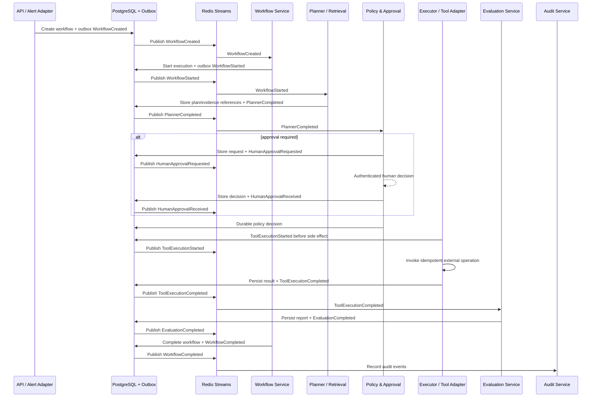
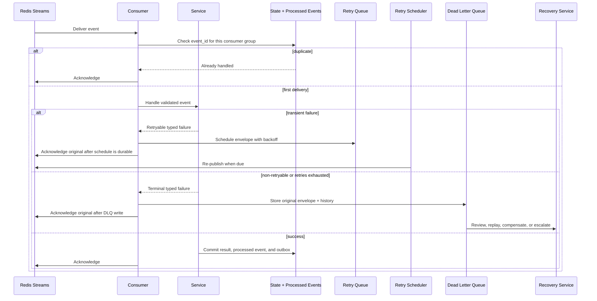

# Event-Driven Architecture

Version: 1.0  
Status: Design baseline

## Core Event Philosophy

Events are immutable, versioned statements that a business or operational fact has occurred. They are the durable coordination record between independently deployed API, workflow, agent, policy, recovery, notification, and observability components. Events communicate facts; commands request work. A consumer must not infer a command merely from an unrelated event, and a producer must not publish an event until the represented state change is durable.

The platform uses at-least-once delivery with idempotent processing. This is a deliberate choice: reliable distributed exactly-once processing across databases, Redis, and external remediation tools is not generally achievable without unacceptable coupling. Instead, every consequential operation has a stable identity, durable state transition, deduplication record, and idempotency key. The result is effectively-once business behavior for supported operations, with explicit evidence when a provider cannot guarantee idempotency.

Events are small, self-contained envelopes. Large logs, prompts, documents, tool responses, and evaluation artifacts are stored in Blob Storage or Cosmos DB and referenced by immutable URI, document ID, checksum, classification, and retention metadata. Events never carry raw credentials or unredacted sensitive operational payloads.

### Event Principles

- Publish only after the producing service has committed the corresponding state change; PostgreSQL outbox records are the normal producer boundary.
- Design consumers to be independent, replayable, and idempotent; a new consumer must not require changing the producer.
- Treat event contracts as public internal APIs. Version them, validate them, and preserve compatibility during rollout.
- Preserve causality with correlation, causation, workflow, and execution identifiers on every event.
- Use durable Streams for business events and commands. Redis Pub/Sub is reserved for lossy, non-business live notifications.
- Include provenance for agent evidence and policy decisions so the event trail explains both action and rationale.
- Do not use an event as authorization. A policy decision and approval state are checked again at the action boundary.

## Event Naming Convention

Event names use `Domain.Subject.PastTense` in the schema registry and a stable stream-safe equivalent such as `domain.subject.past_tense.v1` in Redis. Names describe an observed result, not an implementation method or future intent.

| Rule | Example | Rationale |
| --- | --- | --- |
| Use a bounded domain prefix. | `workflow.created`, `policy.violation`, `agent.failed` | Prevents namespace collision and makes routing intelligible. |
| Use a singular subject and past-tense verb. | `retrieval.completed` | States a fact and avoids imperative ambiguity. |
| Include a version in the stream/contract identity. | `workflow.completed.v1` | Allows safe schema evolution and consumer migration. |
| Keep the type semantic, not technical. | `tool.execution.completed`, not `redis.message.sent` | Consumers care about business outcomes, not transport internals. |
| Use commands separately. | `workflow.start.requested`, `action.execute.requested` | Makes requested work distinct from completed work. |

The catalogue below uses the requested PascalCase names as the canonical documentation aliases. Their registered event types follow the stream-safe convention; for example, `WorkflowCreated` maps to `workflow.created.v1`.

## Event Envelope

Every event follows one envelope contract. Payload schemas are specific to the event type and version; the envelope is common across all events.

| Field | Required | Description |
| --- | --- | --- |
| `event_id` | Yes | Globally unique immutable event identifier. Used for deduplication and audit. |
| `event_type` | Yes | Registered type, for example `workflow.created.v1`. |
| `schema_version` | Yes | Payload contract version, independent of deployment version. |
| `occurred_at` | Yes | UTC timestamp at which the represented fact occurred. |
| `produced_at` | Yes | UTC timestamp at which the producer serialized the event. |
| `producer` | Yes | Logical service/component name and deployed version. |
| `tenant_id` | Yes when multi-tenant | Tenant/security boundary and partitioning scope. |
| `correlation_id` | Yes | End-to-end business request/incident trace identifier. |
| `causation_id` | Yes except root event | ID of the event or command that directly caused this event. |
| `workflow_id` | Yes for workflow-scoped work | Stable workflow aggregate identifier. |
| `execution_id` | Yes when an execution exists | Specific start/resume attempt within a workflow. |
| `subject_id` | Yes | Primary entity affected, such as action, approval, document, or graph entity ID. |
| `sequence` | Required for ordered workflow events | Monotonic workflow/execution sequence allocated by the authoritative service. |
| `idempotency_key` | Yes for externally observable work | Stable operation identity used to collapse repeated delivery. |
| `trace_context` | Yes | W3C/OpenTelemetry-compatible trace propagation data. |
| `actor` | Yes when initiated or approved | Human, service, or agent identity with authority scope. |
| `payload` | Yes | Validated type-specific data, kept bounded and redacted. |
| `artifact_references` | When applicable | URIs/document IDs, checksums, classifications, and retention attributes. |
| `policy_context` | When applicable | Policy/approval version and decision reference; never a substitute for revalidation. |
| `integrity` | Yes | Payload checksum/signature metadata where required by the trust boundary. |

### Correlation, Workflow, and Execution Identifiers

`correlation_id` connects all work caused by one incoming alert, operator request, or externally supplied trace. It remains stable across retries, recovery attempts, notifications, audit entries, and traces.

`workflow_id` identifies the durable business process. It persists from `WorkflowCreated` until final retention/archive, regardless of pause, resume, worker replacement, or recovery. A workflow may have many executions.

`execution_id` identifies one runtime attempt. A new execution ID is created when a workflow starts or resumes under a new runtime attempt, while retries within a single attempt retain the same execution ID plus an attempt number. This separation distinguishes one long-lived incident workflow from the individual processing attempt that produced a result.

`causation_id` links direct ancestry, while `correlation_id` links the broader tree. Together with `sequence`, `actor`, and trace context, they provide an auditable explanation without relying on clock ordering.

## Event Versioning

Event types use additive evolution first: new optional fields with safe defaults may be introduced in a compatible version. Removing, renaming, changing meaning, or changing a field's type requires a new major schema version and a new registered stream type. Producers publish the version selected by configuration; consumers declare supported versions and reject unknown incompatible contracts to the DLQ with a clear reason.

During migration, producers can dual-publish compatible versions through the outbox or an adapter, and consumers are migrated before the old version is retired. The schema registry records owner, lifecycle state, JSON/Pydantic contract reference, compatibility decision, sample/redacted fixture, retention classification, and deprecation date. Contracts are validated by producer and consumer contract tests.

## Redis Streams Design

### Stream Topology

Redis Streams is the durable asynchronous transport. Streams are separated by event purpose and schema version, with consumer groups scoped to a logical consumer responsibility rather than an individual process.

| Stream family | Example | Producers | Consumer groups | Purpose |
| --- | --- | --- | --- | --- |
| Commands | `ops:workflow:commands:v1` | API, scheduler, services | workflow-orchestrator | Requests durable work; not a domain fact. |
| Workflow events | `ops:workflow:events:v1` | Workflow service/outbox relay | agents, evaluation, audit, notifications | Lifecycle facts and stage outcomes. |
| Governance events | `ops:governance:events:v1` | Policy/approval services | workflow-orchestrator, audit, notifications | Policy, violation, and approval outcomes. |
| Operations events | `ops:operations:events:v1` | Cache, graph, observability, audit services | observability, reporting, audit | Supporting operational facts. |
| Recovery events | `ops:recovery:events:v1` | Recovery service, scheduler | workflow-orchestrator, audit, notifications | Retry, compensation, and escalation coordination. |
| Retry queue | `ops:retry:scheduled:v1` | Event/recovery services | retry scheduler | Deferred envelopes with next-attempt time. |
| Dead-letter queue | `ops:dlq:v1` | Event service | DLQ operations/recovery | Exhausted or invalid messages with failure history. |

The exact namespace is environment-prefixed and includes tenant isolation where required. The transport stream name is not used as a security authorization mechanism: authorization is re-evaluated by the consuming service.

### Producer and Consumer Rules

1. A service commits state, idempotency state, audit index, and outbox record in one PostgreSQL transaction.
2. The outbox relay publishes the validated envelope to the appropriate Redis Stream and marks the outbox event published after broker acknowledgement.
3. Consumers use consumer groups. They validate type/version and tenant scope, claim abandoned pending entries after an idle threshold, and check their durable `processed_events` ledger before work.
4. A consumer commits its resulting state, processed-event record, and further outbox events before acknowledging the Stream message.
5. Stream retention is deliberate and monitored. Durable history belongs in PostgreSQL/Cosmos DB/Blob Storage; streams retain operational replay windows, not indefinite evidence.

### Dead Letter Queue

An event enters the DLQ only after validation failure, an explicitly non-retryable error, or exhaustion of the event's bounded retry policy. A DLQ record retains the original envelope unchanged plus stream/message identifiers, consumer group, failure classification, sanitized error, attempt history, first/last failure timestamps, and a replay eligibility flag.

DLQ records are observable work items, not a disposal bin. The operations/recovery consumer categorizes them as replay, compensate, correct data, escalate, or permanently close with audit evidence. Replay creates a new delivery attempt that retains the original `event_id` and idempotency key; corrections create a new linked event rather than mutating original history.

### Retry Queue

Retry scheduling is decoupled from active consumers. A retry record contains the original event reference/envelope, retry count, error class, next-attempt timestamp, deadline, and retry policy version. A scheduler promotes due records back to their original stream or a recovery stream. Backoff is exponential with jitter, capped attempts, and a total deadline. Retries are only allowed for safe, classified transient failures; side-effecting operations require an idempotency key and state re-check before retry.

## Delivery Semantics, Ordering, and Duplicate Prevention

### At-Least-Once, Not Distributed Exactly-Once

Redis consumer groups, process restarts, network ambiguity, and external tools can redeliver messages. Therefore the platform promises at-least-once delivery. It achieves effectively-once business behavior with transactional outbox publication, durable processed-event records, unique idempotency keys, compare-and-set workflow state versions, and provider-side idempotency support.

An “exactly once” claim would be misleading: it cannot guarantee an external rollback, scaling, or notification happened exactly one time when the provider succeeds but its response is lost. The platform instead records the uncertain outcome, queries the provider with the idempotency key when possible, and enters recovery/escalation if certainty cannot be established.

### Ordering

Global order is neither required nor scalable. Ordering is required only within a workflow or action. Events are partitioned/routed using a stable workflow key; every ordered event carries a monotonic sequence. Consumers apply expected-state/sequence checks and buffer or defer only within a bounded policy when a predecessor is missing. Unrelated workflows may execute in parallel.

### Duplicate Prevention

- Producers assign one immutable `event_id` and stable `idempotency_key` before outbox insertion; unique constraints prevent duplicate logical publication.
- Consumers record `(consumer_group, event_id)` durably in the same transaction as their result. A repeated delivery returns the prior outcome and is safely acknowledged.
- Workflow and action transitions require expected status/version, so a stale event cannot re-open a completed stage.
- Tool adapters receive the action idempotency key and retain or query provider execution references. Retry occurs only after current action state is reloaded.
- Artifact references include checksum/version so a duplicated event cannot silently overwrite evidence.

## Event Catalogue

All events use the common envelope. Payload definitions below list the minimum business data; artifact references, provenance, policy context, and observability metadata are added where relevant. “Consumers” identifies the logical services that may react; each is independently idempotent. An event may be retained for audit even when no immediate consumer is configured.

### Workflow and Orchestration Events

| Event | Type | Producer | Consumers | Purpose and minimum payload |
| --- | --- | --- | --- | --- |
| `WorkflowCreated` | `workflow.created.v1` | WorkflowService after durable workflow creation | Workflow orchestrator, audit, observability, notification | Announces a new workflow. Includes workflow type, intake source, initial priority, incident/reference IDs, configuration version, and initial state. |
| `WorkflowStarted` | `workflow.started.v1` | WorkflowService/runtime coordinator | Planner, retrieval coordinator, audit, observability | Confirms an execution has begun. Includes execution ID, runtime name/version, deadline, start sequence, and checkpoint reference if resumed. |
| `WorkflowCompleted` | `workflow.completed.v1` | WorkflowService after terminal success | Notification, audit, observability, reporting, memory service | Confirms successful terminal state. Includes outcome summary, completed actions, evaluation reference, final checkpoint, and artifact references. |
| `WorkflowFailed` | `workflow.failed.v1` | WorkflowService or RecoveryService after terminal failure | Recovery, notification, audit, observability, reporting | Confirms failed/escalated terminal state. Includes failure category, last safe state, failed stage, recovery summary, and escalation reference. |

### Agent, Retrieval, and Tool Events

| Event | Type | Producer | Consumers | Purpose and minimum payload |
| --- | --- | --- | --- | --- |
| `PlannerStarted` | `planner.started.v1` | Planner agent coordinator | Observability, audit, workflow projector | Marks planning start. Includes planning objective, input evidence references, planner/model version, deadline, and stage attempt. |
| `PlannerCompleted` | `planner.completed.v1` | Planner agent coordinator | Policy service, workflow orchestrator, evaluation, audit, observability | Supplies proposed diagnosis and ordered plan. Includes plan reference/hash, hypotheses, evidence provenance, confidence, action risk estimates, and model metadata. |
| `RetrievalStarted` | `retrieval.started.v1` | RetrievalService or retrieval agent coordinator | Observability, audit | Marks context gathering start. Includes retrieval intent, source scopes, graph/document query references, and freshness requirements. |
| `RetrievalCompleted` | `retrieval.completed.v1` | RetrievalService | Planner, evaluator, memory service, audit, observability | Supplies bounded, access-filtered evidence. Includes document/graph references, scores, provenance, freshness, exclusions, and context manifest URI. |
| `ToolExecutionStarted` | `tool.execution.started.v1` | Executor service immediately before invoking approved tool | Observability, audit, recovery watchdog | Records intended external action. Includes action ID, approved capability, tool operation, masked parameters reference, policy/approval reference, timeout, and idempotency key. |
| `ToolExecutionCompleted` | `tool.execution.completed.v1` | Executor service after verified tool result | Workflow orchestrator, evaluator, audit, observability, recovery | Records observed tool outcome. Includes action ID, provider execution reference, result classification, output artifact reference, duration, idempotency key, and verification status. |
| `AgentFailed` | `agent.failed.v1` | Any agent coordinator after typed agent failure | Recovery, workflow orchestrator, audit, observability | Reports a bounded agent-stage failure. Includes agent role/version, stage, failure class, retryability, attempt count, last checkpoint, and sanitized diagnostics. |
| `ToolFailed` | `tool.failed.v1` | Executor/tool adapter after tool failure or indeterminate outcome | Recovery, workflow orchestrator, policy, audit, observability | Reports failed/uncertain external action. Includes action/tool IDs, provider reference if available, failure class, retryability, timeout/attempt data, and compensation requirement. |

### Evaluation, Recovery, and Governance Events

| Event | Type | Producer | Consumers | Purpose and minimum payload |
| --- | --- | --- | --- | --- |
| `EvaluationStarted` | `evaluation.started.v1` | EvaluationService | Observability, audit, workflow projector | Marks outcome assessment start. Includes evaluation definition/version, target workflow/execution, criteria, and evidence set reference. |
| `EvaluationCompleted` | `evaluation.completed.v1` | EvaluationService | Workflow orchestrator, recovery, reporting, audit, observability | Provides scores and gate result. Includes report reference, score components, evaluator version, pass/fail/indeterminate outcome, and recommended next state. |
| `RecoveryStarted` | `recovery.started.v1` | RecoveryService | Workflow orchestrator, audit, observability, notification | Marks a recovery attempt. Includes triggering event/failure, selected strategy (retry/compensate/escalate), source checkpoint, and policy context. |
| `RecoveryCompleted` | `recovery.completed.v1` | RecoveryService | Workflow orchestrator, audit, observability, notification | Records recovery result. Includes strategy outcome, resulting state/checkpoint, actions taken, unresolved risk, and escalation status. |
| `PolicyViolation` | `policy.violation.v1` | PolicyService | Workflow orchestrator, audit, notification, observability, recovery | Reports denied or prohibited behavior. Includes policy/version, violated rule, subject/action, risk, decision, safe alternative, and approval eligibility. |
| `HumanApprovalRequested` | `approval.requested.v1` | PolicyService / ApprovalService | Notification, approval UI/webhook, audit, observability | Requests a human decision. Includes approval ID, action/plan reference, risk explanation, expiry, permitted decision scope, and evidence links. |
| `HumanApprovalReceived` | `approval.received.v1` | ApprovalService after authenticated decision | Workflow orchestrator, audit, observability, notification | Records approval, rejection, or expiry. Includes approval ID, authenticated actor, decision, decision time, expiry validation, rationale, and policy version. |

### Knowledge, Memory, Cache, and Operational Events

| Event | Type | Producer | Consumers | Purpose and minimum payload |
| --- | --- | --- | --- | --- |
| `CacheHit` | `cache.hit.v1` | CacheService | Observability, capacity analytics | Records a cache response. Includes cache namespace/key hash, data class, age/TTL, caller role, and latency; never emits cached content. |
| `CacheMiss` | `cache.miss.v1` | CacheService | Observability, capacity analytics | Records a cache miss. Includes cache namespace/key hash, caller role, fallback source, and latency. |
| `GraphUpdated` | `graph.updated.v1` | Graph ingestion service / GraphRepository adapter | Retrieval cache invalidator, audit, observability, indexing | Announces a validated graph change. Includes graph entity/relationship IDs, operation, source provenance, graph schema version, and invalidation scope. |
| `MemoryStored` | `memory.stored.v1` | MemoryService | Audit, observability, retrieval/index projection | Records governed memory write. Includes memory ID, scope, summary/classification, source references, retention policy, redaction status, and checksum. |
| `MemoryRetrieved` | `memory.retrieved.v1` | MemoryService | Observability, audit, evaluation | Records memory recall. Includes requested scope/intent, returned memory references, ranking/provenance, access decision, and no raw sensitive contents. |
| `ObservabilityRecorded` | `observability.recorded.v1` | ObservabilityService | Telemetry exporter, audit (where required) | Confirms a material platform telemetry record. Includes signal type, trace/span references, metric/log artifact reference, sampling decision, and severity. |
| `AuditRecorded` | `audit.recorded.v1` | AuditService | Compliance projection, observability, reporting | Confirms append-only audit capture. Includes audit record ID, actor, action/decision type, target reference, integrity hash, retention class, and detailed-record reference. |

## Sequence Diagrams

### Successful Workflow with Governed Tool Execution

### Retry and Dead-Letter Recovery Path

## Operational Governance

Event lag, pending entries, retry depth, DLQ age, duplicate rate, consumer error rate, schema validation failures, and outbox publication delay are first-class service-level indicators. Alerts must link to runbooks and retain the correlation/workflow IDs needed to retrieve the full execution record. Event retention, redaction, access control, and replay authorization follow the same policy/audit standards as workflow data.

The event architecture remains safe because event handling does not grant autonomous authority: policies and approvals are revalidated at the side-effect boundary, and every event-driven transition is persisted, traceable, recoverable, and idempotent.
