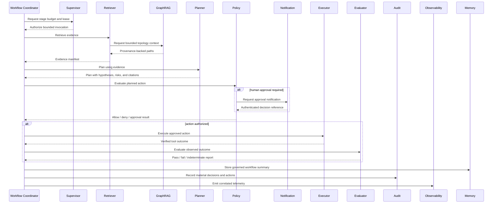
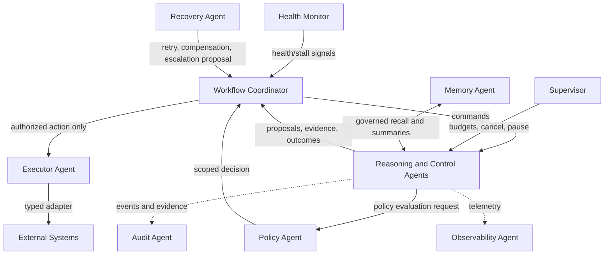

# Autonomous Agent Design

Version: 1.0  
Status: Design baseline

## Agent System Principles

The platform treats an agent as a bounded collaborator with an explicit role, state contract, tool allow-list, and observable outcome—not as an unrestricted process that can reason and act across the system. Some collaborators use model-assisted reasoning (Planner, Retriever, GraphRAG, Evaluator); others are deliberately deterministic control agents (Policy, Audit, Workflow Coordinator). This division is essential: safety, authorization, event durability, and auditability must not depend on probabilistic model behavior.

Agents communicate through workflow state and versioned events. They never access databases directly; services and repositories supply scoped data. They never share hidden mutable state. Every invocation has a workflow ID, execution ID, correlation ID, deadline, cancellation signal, identity/capability scope, and telemetry context. Every consequential recommendation or action is grounded in evidence references, recorded in audit, and evaluated after completion.

### Common Agent Contract

Each agent receives a typed task envelope and returns one of: a validated result, a proposal requiring policy/approval, a deferred outcome, or a typed failure. An agent is responsible for explaining its result with references, not for choosing a workflow transition unless it is the Workflow Coordinator. The coordinator persists the outcome and emits the next event through the transactional outbox.

| Common control | Requirement | Why it exists |
| --- | --- | --- |
| Identity and scope | Per-agent service identity and least-privilege capability set. | An agent can perform only its assigned role. |
| Time and cost budget | Explicit deadline, retry limit, token/query/tool budget, and concurrency limit. | Prevents runaway work during incidents. |
| Input/output validation | Versioned schemas and bounded payload/artifact references. | Stops malformed or untrusted data from propagating. |
| Evidence and provenance | Evidence IDs, source freshness, access decision, and confidence/reliability metadata. | Makes diagnosis and remediation reviewable. |
| State isolation | Read only scoped execution/workflow state through services; write only via outcome events/services. | Eliminates hidden coupling and unsafe concurrent mutation. |
| Policy boundary | Policy is evaluated before externally consequential tool action; approval is rechecked at invocation. | Model reasoning cannot grant itself authority. |
| Observability | Structured telemetry for latency, attempt, outcome, model/tool use, and correlation IDs. | Makes agents diagnosable and measurable. |

## 1. Planner Agent

- **Purpose:** Convert a normalized incident and grounded evidence into an explicit investigation and remediation plan. It proposes; it never directly executes remediation.
- **Inputs:** Incident envelope; telemetry/artifact references; retrieval and GraphRAG evidence; workflow goal; constraints; prior plan/checkpoint; policy capability summary.
- **Outputs:** A versioned plan containing hypotheses, ordered steps, evidence references, expected observations, action risk, required capabilities, stop conditions, and confidence; `PlannerStarted`, `PlannerCompleted`, or `AgentFailed` event.
- **Internal reasoning:** Separates facts from hypotheses, ranks root-cause candidates by evidence, identifies information gaps, and proposes reversible diagnostic steps before disruptive actions. It must cite every material claim and label uncertainty.
- **Failure modes:** Insufficient/contradictory evidence, invalid plan schema, model timeout/provider failure, prompt-injection attempt in source material, or plan exceeding budget.
- **Recovery strategy:** Request targeted retrieval, use a constrained fallback plan template, resume from last checkpoint, retry classified provider faults, or escalate to a human with evidence gaps. It never fabricates a plan to reach completion.
- **Metrics:** Plan validity rate, evidence-citation coverage, plan acceptance/policy-denial rate, time to plan, re-plan count, model cost, and diagnosis-to-remediation success correlation.
- **Dependencies:** RetrievalService, MemoryService, ConfigurationService, PolicyService capability summary, model provider adapter, ObservabilityService.
- **Tool access:** Read-only retrieval/model tools only. No database access, no infrastructure, deployment, ticketing, or notification tools.
- **State:** Immutable input snapshot plus plan version, candidate hypotheses, budget consumption, and checkpoint reference held in workflow state.
- **Memory usage:** Reads scoped prior incidents and approved outcomes; writes only a proposed summary through MemoryService after policy/redaction checks.
- **Evaluation:** Evaluator scores grounding, completeness, safety, expected-observation quality, and whether the plan led to an effective outcome.

## 2. Retriever Agent

- **Purpose:** Obtain relevant, access-filtered, fresh textual and structured evidence for a workflow question.
- **Inputs:** Retrieval intent from planner/coordinator; workflow scope; service/environment identifiers; permitted data classes; time window; ranking and freshness constraints.
- **Outputs:** Ranked evidence manifest containing document/snippet/telemetry references, relevance score, source authority, freshness, access decision, exclusions, and context budget; `RetrievalStarted` and `RetrievalCompleted` events.
- **Internal reasoning:** Decomposes the question into bounded searches, uses lexical/semantic/metadata retrieval as configured, deduplicates results, and favors authoritative recent sources. It returns evidence, not a root-cause conclusion.
- **Failure modes:** Empty results, stale index, permission denial, malformed source content, retrieval timeout, or context-size overflow.
- **Recovery strategy:** Broaden or narrow query within budget, use source-specific fallback, return explicit coverage gaps, refresh eligible indexes asynchronously, or defer to human investigation.
- **Metrics:** Recall/precision against evaluated cases, evidence freshness, retrieval latency, empty-result rate, access-filter rejection rate, cache hit rate, and provenance completeness.
- **Dependencies:** RetrievalService, CacheService, Document/Blob adapters, ConfigurationService, ObservabilityService.
- **Tool access:** Approved read-only document, log, metric, trace, and search adapters scoped by policy. No writes, remediation, or direct graph queries.
- **State:** Query plan, cursor/page state, selected evidence references, source coverage, and retrieval budget in execution-scoped state.
- **Memory usage:** May use workflow summaries to refine search; does not create durable memory except via MemoryService on coordinator request.
- **Evaluation:** Retrieval quality is assessed by answer-support coverage, source authority/freshness, relevance, and downstream diagnosis accuracy.

## 3. GraphRAG Agent

- **Purpose:** Enrich retrieval with service topology, dependency, ownership, deployment, symptom, incident, and runbook relationships.
- **Inputs:** Validated graph-retrieval intent; anchor entities such as service, incident, deployment, or symptom; tenant/environment scope; maximum traversal depth and result budget.
- **Outputs:** Bounded subgraph/path manifest with nodes, relationships, path explanations, source provenance, freshness, and confidence; optionally a suggested blast-radius summary.
- **Internal reasoning:** Starts from evidence-backed anchors, traverses only allow-listed relationship types, limits depth, ranks paths by recency/criticality/provenance, and distinguishes observed from inferred relationships.
- **Failure modes:** Missing/ambiguous anchor, stale topology, graph timeout, excessive cardinality, access scope violation, or conflicting source relationships.
- **Recovery strategy:** Fall back to document retrieval and clearly mark graph evidence unavailable; narrow traversal; ask Retriever for disambiguating evidence; route graph data quality issues to ingestion.
- **Metrics:** Anchor-resolution rate, traversal latency, bounded-query compliance, path relevance, graph freshness, downstream root-cause contribution, and graph-query failure rate.
- **Dependencies:** RetrievalService, GraphRepository through service interface, CacheService, ConfigurationService, ObservabilityService.
- **Tool access:** Read-only GraphRAG query operation exposed by RetrievalService. It cannot execute arbitrary Cypher, mutate graph data, or call remediation tools.
- **State:** Anchor IDs, traversal policy, graph schema version, selected path IDs, and invalidation version held per request.
- **Memory usage:** Reads prior graph-supported incident summaries as evidence; writes no graph or memory directly.
- **Evaluation:** Scores path provenance, topology correctness, useful relationship coverage, depth/cardinality discipline, and impact on retrieval/plan quality.

## 4. Executor Agent

- **Purpose:** Perform an explicitly authorized plan step through a typed external tool adapter and record the observed outcome.
- **Inputs:** Action ID; approved plan step; current workflow/action state; policy decision and approval reference; allowed capability; masked parameters reference; timeout; idempotency key.
- **Outputs:** Verified tool result, provider execution reference, output artifact references, duration, outcome classification, and `ToolExecutionStarted`, `ToolExecutionCompleted`, or `ToolFailed` event.
- **Internal reasoning:** Deterministically validates preconditions, rechecks action state and approval expiry, chooses the registered operation specified by the plan, and verifies returned evidence. It does not use unconstrained reasoning to select a new privileged action.
- **Failure modes:** Expired/denied approval, stale action state, provider timeout, quota/rate limit, unavailable tool, malformed response, indeterminate external completion, or failed verification.
- **Recovery strategy:** Query provider by idempotency key; retry only safe transient operations; request compensation via Recovery Agent; stop and escalate when outcome cannot be proven. It never repeats a side effect blindly.
- **Metrics:** Tool success/verification rate, action latency, idempotent replay rate, approval-to-execution delay, provider error rate, compensation rate, and unauthorized-action blocks.
- **Dependencies:** Tool adapter service, PolicyService, WorkflowService, EventService, AuditService, ObservabilityService, ConfigurationService.
- **Tool access:** Only the per-action, allow-listed capability issued by PolicyService; no shell/database/network escape hatch and no credentials exposed to the agent.
- **State:** Action lifecycle, expected state version, provider operation/reference, idempotency key, attempt history, compensation status, and output reference.
- **Memory usage:** Reads prior approved action outcomes only when included as plan evidence; stores outcome summaries through MemoryService only after sanitization and policy checks.
- **Evaluation:** Evaluator checks adherence to authorization, tool-result verification, action effectiveness, idempotency, and audit completeness.

## 5. Evaluator Agent

- **Purpose:** Independently determine whether a diagnosis, plan, action, recovery attempt, or completed workflow met defined success and safety criteria.
- **Inputs:** Evaluation definition/version; workflow and execution evidence; plan; policy decisions; tool results; post-action telemetry; expected observations; baseline comparisons.
- **Outputs:** Evaluation report with criterion scores, evidence links, uncertainty, pass/fail/indeterminate gate, recommended next state, and `EvaluationStarted`/`EvaluationCompleted` event.
- **Internal reasoning:** Applies deterministic checks first, then bounded model-assisted assessment where configured. It compares observed health against baselines, validates evidence coverage, and separates “not proven” from “failed.”
- **Failure modes:** Missing baseline, delayed telemetry, unavailable evidence, evaluator disagreement, provider timeout, or ambiguous health signal.
- **Recovery strategy:** Wait/re-evaluate within deadline, obtain targeted evidence, emit indeterminate rather than false success, or require human review for safety-critical uncertainty.
- **Metrics:** Evaluation latency, agreement with later operator outcome, false-success/false-failure rate, evidence completeness, indeterminate rate, and score drift by evaluator version.
- **Dependencies:** EvaluationService, RetrievalService, MemoryService, WorkflowService read model, ConfigurationService, ObservabilityService.
- **Tool access:** Read-only telemetry/retrieval/evaluation-scorer adapters. It cannot execute remediation, alter policy, or modify workflow state directly.
- **State:** Evaluation definition, baseline and observation windows, evidence manifest, score components, evaluator version, and report reference.
- **Memory usage:** Reads prior comparable outcomes under access control; stores reusable evaluation summaries only through MemoryService with versioned criteria.
- **Evaluation:** Meta-evaluation uses labelled incident outcomes, calibration analysis, scorer reproducibility, and audit review of evidence-to-score traceability.

## 6. Recovery Agent

- **Purpose:** Turn typed workflow, agent, tool, and infrastructure failures into a safe retry, compensation, pause, or escalation path.
- **Inputs:** Failure event; workflow/action current state; retry history; checkpoint; idempotency/provider status; deadlines; policy constraints; evaluation result.
- **Outputs:** Recovery plan/outcome with selected strategy, scheduled retry or compensation reference, escalation details, state transition proposal, and `RecoveryStarted`/`RecoveryCompleted` event.
- **Internal reasoning:** Deterministically classifies failure as transient, permanent, indeterminate, policy-related, or cancellation-related; tests retry eligibility, remaining budget, and compensation safety before acting.
- **Failure modes:** Missing checkpoint, inconsistent state, exhausted retry budget, unavailable compensation tool, unknown external side-effect status, or recovery-loop detection.
- **Recovery strategy:** Use a bounded escalation ladder: re-read state, query idempotency/provider status, retry safe work, compensate verified side effects, pause for approval, then escalate. Detect repeated identical failure signatures and stop looping.
- **Metrics:** Recovery success rate, mean recovery time, retry exhaustion, compensation success, escalation rate, repeated-failure suppression, and unreconciled outcome count.
- **Dependencies:** RecoveryService, WorkflowService, EventService, PolicyService, Executor/tool status interface, AuditService, ObservabilityService, Scheduler.
- **Tool access:** May request only registered status-query or approved compensation operations through Executor; it has no direct infrastructure-write access.
- **State:** Recovery attempt number, triggering event, classification, chosen strategy, checkpoint, retry schedule, compensation references, and loop-detection fingerprint.
- **Memory usage:** Reads prior incident recovery patterns as advisory evidence; stores validated recovery summary only after the workflow terminal state is known.
- **Evaluation:** Evaluator measures whether recovery restored expected workflow/service state without unauthorized repeats or evidence loss.

## 7. Policy Agent

- **Purpose:** Make deterministic, versioned governance decisions about proposed actions, data access, approval requirements, and autonomy limits.
- **Inputs:** Proposed action or data request; actor identity; tenant/environment; capability scope; risk classification; policy version; approval context; change-window and system-health constraints.
- **Outputs:** Allow, deny, require-approval, or defer decision with rule IDs, reasons, expiry, permitted capability scope, and `PolicyViolation` or approval-related event where applicable.
- **Internal reasoning:** Evaluates declarative rules and risk thresholds; may consume model-provided risk as an input but never lets model output determine authorization without deterministic policy rules.
- **Failure modes:** Missing/ambiguous identity, unavailable policy/configuration, conflicting rules, expired approval, or policy evaluation timeout.
- **Recovery strategy:** Fail closed for consequential actions; permit only explicitly configured safe read-only degradation; escalate configuration/policy inconsistency to authorized operators.
- **Metrics:** Decision latency, deny/approval-required rate, policy conflict rate, expired-approval blocks, override rate, unauthorized-action prevention, and policy-version adoption.
- **Dependencies:** PolicyService, ConfigurationService, AuditService, EventService, identity/authorization adapter, WorkflowService read model.
- **Tool access:** No external operational tools, no API route invocation, and no runtime control. It can read policy/configuration and write durable decision/audit records through services.
- **State:** Immutable policy snapshot/version, decision context hash, approval linkage, decision expiry, and rule evaluation trace.
- **Memory usage:** Does not use agent memory for authorization. Policy facts are versioned configuration, not learned memory.
- **Evaluation:** Audits decision reproducibility, rule coverage, false allow/deny findings, approval compliance, and override analysis.

## 8. Audit Agent

- **Purpose:** Produce immutable, queryable evidence that explains who or what decided, approved, executed, recovered, and observed each workflow transition.
- **Inputs:** State transition/event envelope; actor identity; policy/approval reference; tool/provider reference; evidence/artifact hashes; retention and classification policy.
- **Outputs:** Append-only audit record/reference, integrity hash, retention class, and `AuditRecorded` event.
- **Internal reasoning:** Deterministically normalizes source events into an audit schema, applies redaction/classification, links causation/correlation, and verifies mandatory fields. It does not reinterpret the business decision.
- **Failure modes:** Missing mandatory correlation/actor, integrity mismatch, unavailable durable audit store, redaction failure, or retention-policy conflict.
- **Recovery strategy:** Block completion of high-assurance consequential steps until required audit capture succeeds; spool only encrypted, bounded, durable records and replay idempotently; escalate integrity failures.
- **Metrics:** Audit completeness, write latency, integrity-verification failure, replay backlog, redaction failure, and query/export success rate.
- **Dependencies:** AuditService, EventService, ConfigurationService, artifact reference service, ObservabilityService.
- **Tool access:** Append/query operations only through AuditService; no remediation, policy modification, or user-notification authority.
- **State:** Event-to-audit mapping, record hash, retention/hold state, append sequence, and storage reference.
- **Memory usage:** No conversational or learned memory; append-only audit history is distinct from agent memory.
- **Evaluation:** Periodic completeness reconciliation compares workflow/action/policy events to audit records; integrity and access controls are independently reviewed.

## 9. Memory Agent

- **Purpose:** Manage bounded, governed working, episodic, and long-term operational memory for agents and workflows.
- **Inputs:** Memory write/read request; scope (execution, workflow, tenant, global-approved); source references; classification; retention; access context; summarization policy.
- **Outputs:** Memory reference or ranked recall set with provenance, access decision, expiry, and `MemoryStored`/`MemoryRetrieved` event.
- **Internal reasoning:** Validates scope, redacts/minimizes content, deduplicates, summarizes when allowed, computes provenance, and ranks retrieval by relevance/freshness/trust. It never treats a recalled item as authoritative without its source context.
- **Failure modes:** Scope violation, stale/conflicting memory, sensitive-data detection, storage failure, unsupported retention, or poor relevance.
- **Recovery strategy:** Fail closed on unauthorized writes/reads; return source evidence without memory augmentation; invalidate or supersede stale summaries; rebuild from retained authoritative artifacts where possible.
- **Metrics:** Memory retrieval usefulness, freshness, hit rate, scope-denial rate, summarization compression/quality, retention compliance, and stale-memory invalidation time.
- **Dependencies:** MemoryService, RetrievalService, PolicyService, CacheService, AuditService, ConfigurationService, ObservabilityService.
- **Tool access:** Scoped memory-store and retrieval operations only; no direct database, graph mutation, or remediation tools.
- **State:** Scope, memory IDs, source/provenance hash, classification, TTL/hold, summary version, and access log reference.
- **Memory usage:** This agent owns memory lifecycle; it may read/write only via its own governed store interface. Other agents request memory through it.
- **Evaluation:** Sampled human and automated review measures factual fidelity, provenance retention, access control, freshness, and downstream workflow value.

## 10. Observability Agent

- **Purpose:** Convert agent/workflow runtime signals into correlated logs, metrics, traces, dashboards, and alert-worthy operational facts.
- **Inputs:** Telemetry context; lifecycle events; agent timing/outcome; queue and retry metrics; model/tool metadata; sampling and redaction policy.
- **Outputs:** Structured telemetry records, trace/span links, aggregated metrics, alert candidates, and `ObservabilityRecorded` event for material records.
- **Internal reasoning:** Deterministically propagates correlation, applies sampling/redaction, derives standard measurements, and detects threshold/anomaly candidates through configured rules. It does not diagnose an incident or change system state.
- **Failure modes:** Telemetry backend outage, malformed context, cardinality explosion, sampling misconfiguration, or redaction failure.
- **Recovery strategy:** Use bounded local/buffered export where permitted, shed low-priority signals first, retain critical security/audit telemetry, and alert operators about observability degradation.
- **Metrics:** Telemetry delivery rate, trace completeness, log redaction success, metric cardinality, export latency, dropped-signal rate, and alert precision.
- **Dependencies:** ObservabilityService, EventService, ConfigurationService, telemetry provider adapters, AuditService for required evidence.
- **Tool access:** Telemetry emit/query adapters only; no workflow, policy, graph, or remediation tools.
- **State:** Trace context, sampling decision, metric aggregation windows, exporter health, and bounded buffer references.
- **Memory usage:** No long-term reasoning memory. It may retain short-lived aggregation state under strict TTL.
- **Evaluation:** Periodic trace/audit correlation checks, cardinality review, alert-quality review, and synthetic telemetry tests.

## 11. Notification Agent

- **Purpose:** Deliver timely, policy-appropriate workflow, approval, recovery, escalation, and completion messages to people or external systems.
- **Inputs:** Notification-worthy event; recipient routing/ownership; message template/version; severity; delivery policy; tenant/channel permissions; artifact/evidence links.
- **Outputs:** Delivery attempt/result, provider message reference, deduplicated notification state, and notification/audit event or failure outcome.
- **Internal reasoning:** Deterministically selects recipients, channel, template, escalation ladder, deduplication window, and redaction based on configuration. It does not decide whether an action is authorized.
- **Failure modes:** Missing owner/recipient, disabled channel, rate limit, provider failure, duplicate event, unsafe content, or expired approval request.
- **Recovery strategy:** Retry idempotent delivery, use approved fallback channels, escalate to on-call path, and record undelivered critical messages. It never exposes secrets to overcome delivery failure.
- **Metrics:** Delivery success/latency, acknowledgment time, duplicate suppression, fallback use, notification fatigue rate, approval response time, and provider error rate.
- **Dependencies:** NotificationService, ConfigurationService, PolicyService for data-sharing rules, AuditService, EventService, ObservabilityService.
- **Tool access:** Allow-listed email/chat/pager/ticketing adapters with scoped credentials. No infrastructure remediation, policy modification, or raw database access.
- **State:** Notification ID, event/action reference, recipient set, channel, deduplication key, delivery attempts, acknowledgment, and escalation status.
- **Memory usage:** Reads durable routing preferences/ownership via service; no learned memory. Stores no ungoverned recipient content.
- **Evaluation:** Measures correct-recipient rate, timeliness, severity/template accuracy, delivery evidence, and operator feedback.

## 12. Health Monitor Agent

- **Purpose:** Continuously assess platform and workflow health, detect stalled work or dependency degradation, and emit a bounded health signal for recovery or operator action.
- **Inputs:** Heartbeats, workflow deadlines, stream lag/pending entries, consumer status, storage/provider health, runtime checkpoints, SLO thresholds, and maintenance windows.
- **Outputs:** Health assessment, anomaly/stall finding, impacted scope, evidence references, and health/recovery trigger event.
- **Internal reasoning:** Deterministically evaluates configured liveness, readiness, deadline, queue, and SLO rules; correlates symptoms by workflow/dependency without claiming root cause beyond evidence.
- **Failure modes:** Missing telemetry, clock skew, monitor partition, alert storm, stale thresholds, or monitoring dependency outage.
- **Recovery strategy:** Use multi-signal confirmation, suppress duplicates with a fingerprint/cooldown, degrade to conservative “unknown” health, and escalate monitoring blindness rather than asserting health.
- **Metrics:** Detection latency, false-positive/negative rate, stalled-workflow detection coverage, alert deduplication rate, health-check availability, and SLO breach detection time.
- **Dependencies:** Scheduler, ObservabilityService, EventService, WorkflowService read model, Cache/Redis metrics, configuration, provider health adapters.
- **Tool access:** Read-only health/status/query adapters and event publication. It cannot restart, scale, or remediate systems directly.
- **State:** Last heartbeat, health fingerprint, threshold version, cooldown, affected IDs, and monitor checkpoint.
- **Memory usage:** Short-lived historical windows for trend detection; no long-term agent memory without explicit MemoryService request.
- **Evaluation:** Synthetic failures and chaos tests assess detection coverage, delay, duplicate suppression, and operator usefulness.

## 13. Supervisor Agent

- **Purpose:** Enforce agent-level execution budgets, lifecycle rules, dependency isolation, and escalation when a collaborator is unavailable, looping, or violating its contract.
- **Inputs:** Agent invocation metadata; deadlines; concurrency/token/tool budgets; health signals; failure/retry history; policy constraints; workflow priority.
- **Outputs:** Start/continue/pause/cancel/escalate decision, budget status, supervisor finding, and event for material intervention.
- **Internal reasoning:** Deterministically compares runtime behavior to configured limits and expected stage contract. It does not replace the Planner or invent a remediation strategy.
- **Failure modes:** Incomplete agent telemetry, stale budget state, supervisor outage, conflicting priority rules, or false loop detection.
- **Recovery strategy:** Fail safe by pausing non-critical autonomous work, preserve checkpoints, allow configured safe read-only investigation, and hand off to Workflow Coordinator or human operator.
- **Metrics:** Budget-exhaustion rate, cancellation correctness, orphan-task prevention, loop detection accuracy, agent availability, and intervention-to-resolution time.
- **Dependencies:** Runtime/WorkflowService lifecycle interfaces, ConfigurationService, ObservabilityService, EventService, Health Monitor, PolicyService.
- **Tool access:** Runtime lifecycle controls and event publication only. No direct model, infrastructure, graph, or execution-tool authority.
- **State:** Per-agent invocation state, lease/heartbeat, budget counters, cancellation token, retry fingerprint, and supervisor decision history.
- **Memory usage:** No semantic long-term memory; retains bounded operational history for loop and quota decisions.
- **Evaluation:** Review of false pauses/cancellations, budget compliance, orphan work rate, and recovery effectiveness after supervisor intervention.

## 14. Workflow Coordinator Agent

- **Purpose:** Own the durable workflow state machine and coordinate the correct next stage across all collaborators.
- **Inputs:** Workflow events/commands; current aggregate state/version; execution context; runtime checkpoint; policy/approval decisions; evaluation/recovery outcomes; cancellation/deadline state.
- **Outputs:** Validated state transition, next-stage command, pause/resume/cancel/terminal decision, outbox event set, and updated workflow checkpoint reference.
- **Internal reasoning:** Deterministically applies declarative workflow definitions and state transition rules. It chooses which defined stage may run next; it does not produce a diagnosis, authorize actions, or execute tools itself.
- **Failure modes:** Stale/duplicate event, invalid transition, missing checkpoint, runtime unavailable, conflicting concurrent update, or deadline expiration.
- **Recovery strategy:** Use optimistic concurrency and idempotent event handling; reload and reconcile state; resume from checkpoint; emit recovery request for typed failures; terminally escalate unresolved state conflicts.
- **Metrics:** Workflow completion/success rate, state-transition latency, invalid-transition blocks, duplicate-event suppression, pause/resume success, terminal failure rate, and queue lag by stage.
- **Dependencies:** WorkflowService, WorkflowRuntime interface/factory, EventService, PolicyService, RecoveryService, AuditService, ObservabilityService, ConfigurationService.
- **Tool access:** Workflow runtime and event/state service operations only. It cannot call external remediation tools, databases, or policy APIs directly.
- **State:** Authoritative workflow aggregate pointer, state version, stage status, execution ID, checkpoint, event sequence, deadline, cancellation status, and next-command reference.
- **Memory usage:** Reads workflow-scoped summaries/evidence through MemoryService when declared by a workflow definition; does not persist semantic memory itself.
- **Evaluation:** Workflow tests and evaluator reports verify legal state paths, correct policy/approval pauses, recovery behavior, terminal outcome correctness, and audit completeness.

## Complete Interaction Diagrams

### Primary Investigation, Approval, Execution, and Evaluation Flow



### Failure, Supervision, and Recovery Flow

```mermaid
sequenceDiagram
    participant Agent as Any Agent
    participant O as Observability
    participant S as Supervisor
    participant W as Workflow Coordinator
    participant H as Health Monitor
    participant R as Recovery
    participant PO as Policy
    participant E as Executor
    participant N as Notification
    participant A as Audit

    Agent-->>O: Failure telemetry with correlation context
    Agent-->>W: Typed AgentFailed or ToolFailed outcome
    W->>S: Check budget, lease, and loop history
    H-->>W: Stalled workflow or dependency health signal
    W->>R: Request recovery classification
    R->>PO: Validate retry/compensation constraints
    PO-->>R: Permitted recovery scope
    alt safe retry or status query
        R->>E: Request idempotent status/recovery operation
        E-->>R: Verified outcome
        R-->>W: RecoveryCompleted; resume checkpoint
    else compensation required
        R->>E: Request approved compensation
        E-->>R: Compensation result
        R-->>W: Recovered or escalate
    else unsafe or indeterminate
        R->>N: Notify human/on-call escalation
        R-->>W: Pause or terminal escalation
    end
    W->>A: Append failure and recovery audit record
    W->>O: Record final recovery telemetry
```

### Control Boundaries



The diagrams show the essential separation of authority: reasoning agents propose, Policy scopes permission, the Workflow Coordinator transitions durable state, Executor performs only an approved action, and Audit/Observability preserve evidence. This structure enables autonomy without allowing any individual agent to become an unbounded control plane.
