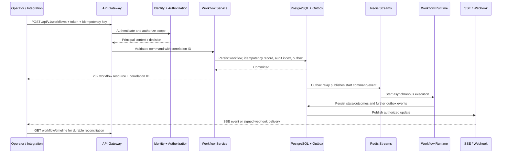

# REST API Design

Version: 1.0  
Status: Design baseline

## API Purpose and Principles

The REST API is the platform control plane. It accepts authenticated workflow requests and webhooks, exposes durable state and evidence, accepts governed approval/cancellation decisions, and provides operational administration. It is not a synchronous interface to agent reasoning or remediation: long-running work is accepted, persisted, and executed through the workflow runtime and event system.

The public resource prefix is `/api/v1`. All JSON endpoints use UTF-8 and `application/json`; timestamps are RFC 3339 UTC; resource identifiers are opaque strings; and request/response schemas are versioned contracts. The API propagates `X-Correlation-ID` when supplied by a trusted caller or creates one and returns it on every response. Clients should retain the returned correlation and workflow identifiers for support and audit.

| Principle | Design decision | Why |
| --- | --- | --- |
| Asynchronous by default | Creation/start/action requests return `202 Accepted` with a workflow or operation resource. | Reasoning, approval, retry, and remediation can outlive the HTTP request. |
| Resource-oriented control plane | Expose workflows, executions, evaluations, approvals, audit records, and configured agents as resources. | Produces predictable permissions, pagination, caching, and audit boundaries. |
| Explicit side effects | Mutating requests require an idempotency key and result in durable state/event records. | Protects callers from network retries duplicating work. |
| Least-privilege visibility | Every read and artifact reference is tenant-, environment-, and role-filtered. | Operational evidence can be sensitive. |
| Stable contracts | Additive versioning, documented errors, and OpenAPI generation from typed schemas. | Allows automation and independently deployed clients to evolve safely. |

## 1. Authentication

The API uses OAuth 2.0/OpenID Connect bearer access tokens issued by the organization's identity provider. Human users authenticate through an interactive authorization flow; service-to-service callers use workload identity or client credentials. The API validates token signature, issuer, audience, expiration, not-before time, and required claims at the gateway before a route is invoked.

| Caller | Authentication mechanism | Additional control |
| --- | --- | --- |
| Operator/UI | OIDC user access token | MFA and conditional access are enforced by the identity provider. |
| Internal service/worker | Managed/workload identity or short-lived client-credential token | Audience-bound token and private network path. |
| External integration webhook | HMAC/signature verification or mutually authenticated TLS, plus timestamp/replay protection | Webhook identity is mapped to a constrained integration principal. |
| Automation client | OAuth client credentials with scoped service principal | Rotated secret/certificate or federated identity; no shared user token. |

Tokens are never accepted in query parameters and are never logged. The gateway passes a normalized `PrincipalContext`—subject, tenant, roles, scopes, authentication method, token expiry, and trace/correlation context—to services. Downstream services use their own service identity rather than forwarding user credentials to arbitrary integrations.

## 2. Authorization

Authorization combines role-based access control, OAuth scopes, tenant/environment boundaries, and policy evaluation for consequential operations. A route-level permission determines whether a caller may request an operation; PolicyService determines whether the requested action is allowed in its current workflow and environment context. API authorization never grants an agent additional tool capability.

| Capability family | Example scope/role | Examples |
| --- | --- | --- |
| Workflow read | `workflows:read` / Operator | View workflow, execution, evidence metadata, and permitted stream. |
| Workflow control | `workflows:write` / Incident Commander | Create, cancel, resume, or retry a workflow. |
| Approval | `approvals:decide` / Authorized Approver | Approve or reject an action within delegated environment/risk scope. |
| Audit/evaluation | `audit:read`, `evaluations:read` / Auditor | Query immutable records and reports. |
| Operations | `metrics:read` / Platform Operator | Query protected operational status and aggregates. |
| Administration | `admin:manage` / Platform Administrator | Manage configuration, policy references, agent registrations, and webhook subscriptions. |

Every access decision is tenant-scoped. Environment and resource ownership filters are applied before data is returned, not merely in the UI. High-risk endpoints require step-up authentication and may require a justification recorded in audit. Access denials use a non-enumerating response: callers are not told whether an inaccessible resource exists.

## 3. Versioning

The major API version is path-based: `/api/v1`. A breaking change introduces `/api/v2`; old versions remain supported for a published deprecation window. Within a major version, changes are additive: new optional fields, resources, or filter values may be added, while field meaning, type, and requiredness remain stable.

Responses include `API-Version`, schema identifier/version, and deprecation headers where appropriate. Date-based deprecation notices are announced in API documentation and an operational change feed. API versioning is separate from event schema versioning; an API action may cause an event at a different, independently managed contract version.

## 4. Response Schema Philosophy

Responses are typed, explicit, and resource-centric. They do not expose database rows, provider credentials, internal prompts, stack traces, raw model chain-of-thought, or unfiltered artifacts. A representation includes stable identity, lifecycle state, timestamps, links or references to related permitted resources, and a schema version.

Successful single-resource responses use a top-level `data` object. Collection responses use `data`, `page`, and optional `links`. Asynchronous mutation responses include `data` for the accepted operation/workflow representation and `meta` with correlation and idempotency information. Field-level redaction is represented by an explicit `redacted_fields` indicator where useful; an omitted field must not be interpreted as authorization to infer its value.

| Response element | Meaning |
| --- | --- |
| `data` | Typed resource or array of typed resources. |
| `meta` | Correlation ID, request ID, schema/API version, idempotency result, warnings, and server time. |
| `links` | Stable relative links to permitted related resources or continuation URLs. |
| `page` | Cursor, page size, `has_more`, and optional count only when cost is acceptable. |
| `errors` | One or more structured problem objects on non-success responses. |

## 5. Pagination, Filtering, and Querying

All list endpoints use cursor-based pagination. Clients pass `page[size]` and an opaque `page[after]` cursor; responses return the next cursor only when more permitted records exist. The server enforces a conservative default and maximum page size. Offset pagination is avoided because rapidly changing workflow and audit data can create gaps, duplicates, and expensive scans.

Filtering uses documented query parameters only. Common filters include `tenant_id` (administrative callers only), `status`, `workflow_type`, `environment`, `severity`, `created_after`, `created_before`, `updated_after`, `actor_id`, `event_type`, `agent_type`, and `correlation_id`. Repeated fields use a documented array convention. Sort is limited to indexed fields and a fixed allow-list, such as `created_at`, `updated_at`, or severity; unbounded free-form query/sort expressions are rejected.

Time filters use UTC and are inclusive/exclusive as documented per endpoint. Search endpoints use separate, explicitly bounded query contracts instead of turning list filters into unrestricted full-text or graph queries. The API returns a warning when a requested filter is ignored for authorization reasons; it does not silently broaden results.

## 6. Error Responses

All errors use `application/problem+json` with an RFC 7807-compatible structure extended for platform correlation. Errors are safe for clients, actionable for operators, and never disclose secrets, stack traces, inaccessible resource existence, or internal provider details.

| Field | Description |
| --- | --- |
| `type` | Stable URI-like error category, for example `https://api.sentinel.example/errors/validation-failed`. |
| `title` | Short human-readable category. |
| `status` | HTTP status code. |
| `detail` | Safe, specific explanation. |
| `instance` | Request/operation instance identifier. |
| `code` | Stable machine-readable platform error code. |
| `correlation_id` | Identifier required for support and trace lookup. |
| `retryable` | Whether the caller may safely retry under documented conditions. |
| `errors` | Optional field-level validation errors with JSON-pointer-like locations. |

| Status | Use | Client behavior |
| --- | --- | --- |
| `400` | Malformed request or unsupported filter. | Correct request; do not blindly retry. |
| `401` | Missing, invalid, or expired authentication. | Obtain valid credentials. |
| `403` | Authenticated but not authorized/policy-permitted. | Do not retry unless authority or approval changes. |
| `404` | Resource absent or intentionally non-enumerable. | Treat as unavailable. |
| `409` | State version conflict, duplicate incompatible request, or invalid lifecycle transition. | Read current state and reconcile. |
| `412` | Required conditional request/precondition failed. | Refresh resource/ETag and retry if appropriate. |
| `422` | Semantically invalid request, including disallowed action parameters. | Correct submitted data. |
| `429` | Rate or concurrency limit exceeded. | Respect `Retry-After` and back off. |
| `500` | Unexpected server fault. | Retry only if `retryable` is true. |
| `502`/`503`/`504` | Dependency unavailable, service unavailable, or timeout. | Use idempotency key and bounded retry. |

## 7. Rate Limiting and Idempotency

Rate limits protect the control plane and downstream model/tool providers. Limits are enforced by tenant, principal, route class, source IP where relevant, and expensive resource class. A response includes standard limit headers and `Retry-After` for `429`. Approval and emergency read paths can use separately configured budgets; they are not made unlimited.

All side-effecting `POST`, `PUT`, `PATCH`, and action endpoints require an `Idempotency-Key` header scoped to principal, route, and request body hash. The server stores the accepted request/result reference for a bounded retention period. Reuse with the identical semantic request returns the original result; reuse with different content returns `409`. For workflow creation this prevents duplicate incident workflows from transport retries; it does not suppress intentionally distinct incidents unless the client supplies the same key.

## 8. Health Endpoints

Health endpoints are deliberately split to support orchestrators without exposing sensitive dependency detail publicly.

| Method and path | Auth | Purpose | Response behavior |
| --- | --- | --- | --- |
| `GET /health/live` | None inside trusted network | Process liveness only. | `200` when process can respond; does not check dependencies. |
| `GET /health/ready` | None inside trusted network or platform identity | Readiness for traffic. | `200` only when required configuration, stores, and event dependencies meet readiness policy; otherwise `503`. |
| `GET /api/v1/health` | `metrics:read` or operations role | Authenticated summarized dependency and queue health. | Redacted status, version, and correlation metadata; no credentials or topology details. |
| `GET /api/v1/health/dependencies` | operations role | Per-dependency health and degraded capability state. | Redacted, rate-limited operational diagnosis. |

Liveness is never used to decide workflow correctness. Readiness gates new work when a required dependency is unavailable; existing workflows recover through the event/recovery path.

## 9. Workflow Endpoints

| Method and path | Permission | Purpose | Success response |
| --- | --- | --- | --- |
| `POST /api/v1/workflows` | `workflows:write` | Create a workflow from an incident, task, or approved template. Requires idempotency key. | `202` with workflow resource, initial status, and links. |
| `GET /api/v1/workflows` | `workflows:read` | List permitted workflows with cursor pagination/filtering. | `200` collection. |
| `GET /api/v1/workflows/{workflow_id}` | `workflows:read` | Retrieve current workflow summary, state, evidence/plan links, and permitted actions. | `200` resource. |
| `GET /api/v1/workflows/{workflow_id}/timeline` | `workflows:read` | Retrieve ordered lifecycle timeline and event references. | `200` paged collection. |
| `POST /api/v1/workflows/{workflow_id}/start` | `workflows:write` | Start a created/paused workflow when its definition permits. | `202` accepted operation. |
| `POST /api/v1/workflows/{workflow_id}/cancel` | `workflows:write` | Request safe cancellation; execution stops at a defined safe boundary. | `202` cancellation operation. |
| `POST /api/v1/workflows/{workflow_id}/resume` | `workflows:write` | Resume an eligible paused/recoverable workflow. | `202` accepted operation. |
| `POST /api/v1/workflows/{workflow_id}/retry` | `workflows:write` plus policy check | Request controlled retry from an eligible stage/checkpoint. | `202` accepted operation or `403`/`409`. |
| `GET /api/v1/workflows/{workflow_id}/artifacts` | `workflows:read` | List artifact metadata and permitted signed retrieval links. | `200` paged collection. |
| `POST /api/v1/workflows/{workflow_id}/approvals/{approval_id}/decisions` | `approvals:decide` | Approve or reject a pending decision within delegated authority. | `202` durable decision resource. |

Workflow mutations do not wait for agents. A `202` means the request was validated and durably accepted; it does not mean diagnosis or remediation succeeded. Clients follow the resource link, stream, webhook, or timeline for terminal outcome.

## 10. Execution Endpoints

An execution is a specific runtime attempt within a workflow. It provides detailed, permission-filtered operational visibility without allowing callers to bypass the Workflow Coordinator.

| Method and path | Permission | Purpose |
| --- | --- | --- |
| `GET /api/v1/workflows/{workflow_id}/executions` | `workflows:read` | List execution attempts and their state/checkpoint summaries. |
| `GET /api/v1/workflows/{workflow_id}/executions/{execution_id}` | `workflows:read` | Retrieve execution metadata, stage status, deadlines, and runtime-neutral checkpoint reference. |
| `GET /api/v1/workflows/{workflow_id}/executions/{execution_id}/steps` | `workflows:read` | Retrieve plan/step outcomes, policy status, and permitted evidence links. |
| `GET /api/v1/workflows/{workflow_id}/executions/{execution_id}/events` | `workflows:read` | Retrieve execution-scoped event references in sequence order. |
| `POST /api/v1/workflows/{workflow_id}/executions/{execution_id}/cancel` | `workflows:write` | Request cancellation of the active execution; subject to safe-boundary behavior. |

Execution endpoints are read-heavy and use ETag/conditional GET where practical. Checkpoint payloads, hidden model context, and unredacted secrets are never returned; the API exposes a safe checkpoint summary and artifact references only.

## 11. Agent Endpoints

Agent endpoints provide operational visibility and controlled management of registered agent capabilities. They do not provide an unrestricted “prompt an agent” endpoint, because that would bypass workflows, policies, budgets, and audit.

| Method and path | Permission | Purpose |
| --- | --- | --- |
| `GET /api/v1/agents` | `agents:read` or operations role | List registered agent types, versions, health, supported workflow stages, and capability summaries. |
| `GET /api/v1/agents/{agent_id}` | `agents:read` | Retrieve one agent registration, configuration reference, operational status, and allowed tools summary. |
| `GET /api/v1/agents/{agent_id}/metrics` | `metrics:read` | Retrieve bounded agent-specific operational metrics. |
| `POST /api/v1/agents/{agent_id}/maintenance` | `admin:manage` | Place an agent implementation in/out of controlled maintenance according to policy. |
| `GET /api/v1/agents/{agent_id}/runs` | `workflows:read` plus scope | List permitted invocations/runs for investigation; payload details remain redacted by role. |

Agent configuration changes occur through audited admin configuration resources and take effect according to versioned rollout policy. An agent cannot be enabled if its tool scopes, policy compatibility, health checks, and schema compatibility are not valid.

## 12. Evaluation Endpoints

| Method and path | Permission | Purpose |
| --- | --- | --- |
| `GET /api/v1/evaluations` | `evaluations:read` | List permitted evaluation reports by workflow, definition, outcome, time, or evaluator version. |
| `GET /api/v1/evaluations/{evaluation_id}` | `evaluations:read` | Retrieve report summary, score components, evidence references, and evaluator metadata. |
| `GET /api/v1/workflows/{workflow_id}/evaluations` | `evaluations:read` | Retrieve evaluations associated with a workflow. |
| `POST /api/v1/workflows/{workflow_id}/evaluations` | `evaluations:write` | Request a permitted re-evaluation against a named definition/version. | 
| `GET /api/v1/evaluation-definitions` | `evaluations:read` | List available, versioned evaluation definitions. |

Evaluation creation is asynchronous and returns `202`. A report exposes criteria, evidence provenance, confidence, and pass/fail/indeterminate status; it never treats model-generated commentary as the sole authoritative score where deterministic evidence is available.

## 13. Audit Endpoints

Audit APIs are read-oriented and append-only from the caller perspective. They return immutable record representations, integrity metadata, and permitted evidence references. Filtering is constrained and heavily authorized to avoid accidental disclosure of cross-tenant or sensitive operational activity.

| Method and path | Permission | Purpose |
| --- | --- | --- |
| `GET /api/v1/audit-records` | `audit:read` | Query audit records by permitted workflow, execution, action, actor, event type, and time window. |
| `GET /api/v1/audit-records/{audit_id}` | `audit:read` | Retrieve one audit record and integrity/retention metadata. |
| `GET /api/v1/workflows/{workflow_id}/audit-records` | `audit:read` | Retrieve workflow-scoped audit trail. |
| `POST /api/v1/audit-records/exports` | `audit:export` | Create a governed asynchronous export for a constrained query. |
| `GET /api/v1/audit-records/exports/{export_id}` | `audit:export` | Retrieve export status and a short-lived authorized download reference when ready. |

Audit export requests are rate-limited, time-window bounded, policy-reviewed, and themselves audited. Records are not edited through the API; corrections generate linked, append-only records.

## 14. Metrics Endpoints

Metrics are split between machine-scrape infrastructure metrics and authenticated operator summaries. High-cardinality workflow and tenant data is not exposed through a public scrape endpoint.

| Method and path | Auth | Purpose |
| --- | --- | --- |
| `GET /metrics` | Trusted scrape network / mTLS | Prometheus-compatible service metrics with controlled labels. |
| `GET /api/v1/metrics/summary` | `metrics:read` | Authenticated aggregate platform metrics: workflow success, queue lag, recovery, tool success, and latency. |
| `GET /api/v1/metrics/workflows` | `metrics:read` | Filtered workflow performance aggregates over bounded windows. |
| `GET /api/v1/metrics/agents` | `metrics:read` | Agent availability, latency, error, budget, and evaluation aggregates. |
| `GET /api/v1/metrics/integrations` | operations role | Provider/tool health and rate-limit aggregates with sensitive details redacted. |

Metrics query endpoints accept only bounded time ranges, documented aggregate dimensions, and allow-listed groupings. Raw traces/logs are accessed through their evidence resources, not embedded in aggregate metric responses.

## 15. Admin Endpoints

Admin endpoints are isolated by route group, require `admin:manage`, are audit-mandatory, and should be exposed only through a hardened administrative network path. High-impact changes may require dual control or approval.

| Method and path | Purpose |
| --- | --- |
| `GET /api/v1/admin/configurations` and `GET /api/v1/admin/configurations/{key}` | Retrieve versioned, non-secret configuration metadata. |
| `POST /api/v1/admin/configurations` | Create a proposed configuration version; activation follows validation/approval policy. |
| `POST /api/v1/admin/configurations/{key}/activate` | Activate an approved version through controlled rollout. |
| `GET /api/v1/admin/policies` | List policy versions, states, and compatibility metadata. |
| `POST /api/v1/admin/policies` and `POST /api/v1/admin/policies/{id}/activate` | Propose and activate approved policy versions. |
| `GET /api/v1/admin/webhooks` / `POST /api/v1/admin/webhooks` | Manage webhook subscriptions, endpoint metadata, and event selections. |
| `POST /api/v1/admin/agents/{agent_id}/maintenance` | Change registered agent maintenance state. |
| `GET /api/v1/admin/dead-letters` / `POST /api/v1/admin/dead-letters/{id}/replay` | Investigate and request policy-controlled DLQ replay. |

Secrets cannot be read or written through these APIs. Configuration and policy resources contain references to secret providers, never secret values. All writes use conditional versioning and idempotency keys to prevent concurrent administrative changes from overwriting each other.

## 16. Webhooks

### Inbound Webhooks

Inbound webhooks accept alerts, deployment changes, documentation ingestion signals, and authorized approval callbacks. Each integration has a route or integration identifier, a verified signing secret/certificate reference, replay window, timestamp/nonce requirement, source schema version, and rate limit. The gateway verifies signature before parsing or enqueueing work, stores the raw payload only in governed artifact storage when needed, and returns an acknowledgement only after durable acceptance.

Inbound routes follow the form `POST /api/v1/webhooks/{integration_id}`. They normalize to a workflow command or ingestion event; arbitrary webhook content never directly invokes an agent or tool.

### Outbound Webhooks

Outbound subscriptions deliver selected versioned facts such as workflow completion/failure, approval request, recovery escalation, and evaluation completion. Each delivery includes an event ID, subscription ID, timestamp, schema version, correlation/workflow IDs, bounded payload, and HMAC signature. Consumers must acknowledge a `2xx`; delivery retries use exponential backoff, idempotency/event ID, a bounded expiry, and delivery audit records. Exhausted delivery attempts create a notification failure and, when configured, escalation.

Subscriptions are tenant-scoped and allow-listed by event type and endpoint. DNS/IP egress protections, HTTPS enforcement, signed payloads, secret rotation, payload redaction, and SSRF defenses are mandatory. Outbound webhooks are notifications, not the sole source of a consumer's critical business state; clients can reconcile using resource endpoints and event IDs.

## 17. Streaming Endpoints

Server-Sent Events (SSE) is the preferred streaming API for one-way live workflow and operation updates because it works well with HTTP infrastructure, supports reconnect, and avoids inventing a second bidirectional control plane. Streaming complements REST polling; it does not replace durable event retrieval or webhooks.

| Method and path | Permission | Stream content |
| --- | --- | --- |
| `GET /api/v1/streams/workflows/{workflow_id}` | `workflows:read` | Authorized workflow lifecycle, step, approval, evaluation, recovery, and terminal update summaries. |
| `GET /api/v1/streams/executions/{execution_id}` | `workflows:read` | Execution-stage update summaries and permitted progress/telemetry references. |
| `GET /api/v1/streams/approvals` | `approvals:decide` | Pending/updated approval notifications in the caller's authorized scope. |

SSE event IDs map to durable workflow/event sequence references. Clients reconnect with `Last-Event-ID`; the service replays only a bounded retention window and directs older clients to the timeline endpoint. Streams send keep-alives, enforce connection and per-principal limits, redact fields at subscription time, and close on token expiry. Commands, approvals, cancellation, and administrative changes remain ordinary authenticated REST requests so they receive idempotency, validation, and audit controls.

## 18. OpenAPI Strategy

The platform maintains one generated OpenAPI document per supported major version, such as `/api/v1/openapi.json`, with interactive documentation available only in authorized non-production or hardened administrative contexts. The specification is generated from typed request/response schemas and augmented with operation descriptions, scopes, error types, pagination rules, idempotency requirements, webhook signatures, examples containing synthetic/redacted data, and deprecation metadata.

OpenAPI is treated as a compatibility contract. CI validates schema changes, lints operation IDs and security declarations, runs consumer contract tests, and rejects undocumented breaking changes. The event schema registry remains separate but links from relevant API operations so integrators understand the asynchronous outcomes of accepted requests.

## Request Lifecycle

This design makes the REST API predictable and safe: HTTP requests provide validated control-plane intent, while durable workflow state and events determine execution. Clients receive stable resources, structured errors, replayable updates, and explicit governance rather than a fragile synchronous façade over autonomous work.
