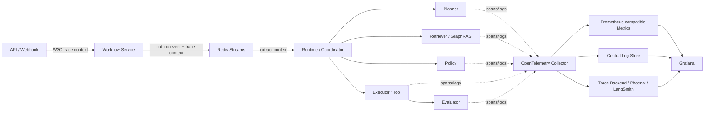
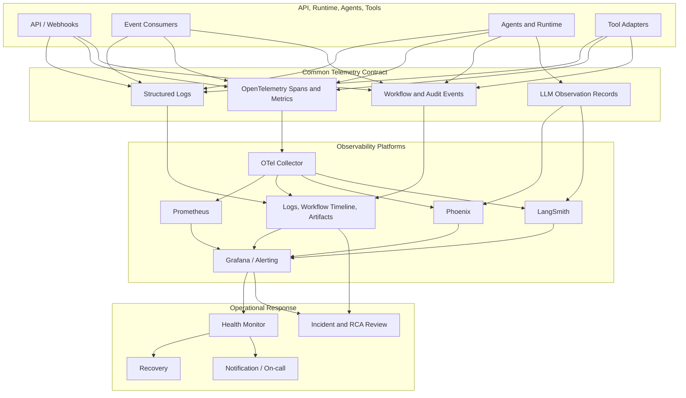

# Production Observability Design

Version: 1.0  
Status: Design baseline

## Observability Objectives

Observability makes the platform and each autonomous workflow explainable in operation. An operator must be able to start with an alert, workflow, execution, agent run, tool action, or model call and reconstruct: what happened, in what order, why the platform chose an action, what evidence it used, whether policy approved it, and whether the outcome was successful.

The design combines structured logs, OpenTelemetry distributed traces, Prometheus metrics, durable workflow/audit events, and LLM-specific observability. No one signal is sufficient: metrics identify that a service is unhealthy, traces locate latency and dependency failure, logs provide structured detail, workflow timelines provide business state, and Phoenix/LangSmith provide model and agent-quality context. All are joined by shared correlation identifiers.

| Objective | Design response | Why it matters |
| --- | --- | --- |
| Diagnose production failures | Correlated logs, traces, metrics, workflow events, and incident timelines. | Distributed agent workflows cannot be understood from one service log. |
| Prove safe autonomy | Persist policy, approval, tool, audit, and evaluation telemetry. | Operators need evidence that remediation was governed. |
| Control latency and cost | Stage latency, queue lag, token use, model/tool cost, and budget metrics. | LLM and external-tool workloads have variable latency and spend. |
| Measure quality | Evaluation scores, grounded-evidence coverage, recovery outcome, and reliability score. | A completed workflow is not necessarily a correct workflow. |
| Drive reliability | SLI/SLO/error-budget dashboards and actionable alerts. | Platform health must be managed as a service, not inferred after incidents. |

## 1. Structured Logging

All services and agents emit structured JSON logs at the application boundary. Human-readable messages are supplemental; fields are the contract used for query, correlation, alert enrichment, and export. Logging is performed through a shared observability interface so domain services do not depend on a vendor SDK.

### Log Schema

| Field group | Required fields | Purpose |
| --- | --- | --- |
| Event identity | `timestamp`, `level`, `message`, `event_name`, `service`, `service_version`, `environment` | Establishes what emitted the record and when. |
| Correlation | `trace_id`, `span_id`, `correlation_id`, `causation_id`, `request_id` | Joins one request/event across services and traces. |
| Workflow scope | `tenant_id` when applicable, `workflow_id`, `execution_id`, `stage`, `agent_role`, `event_id`, `sequence` | Links technical activity to durable business execution. |
| Actor/governance | `actor_type`, safe `actor_id`, `policy_decision_id`, `approval_id`, `action_id`, `idempotency_key` | Explains authority and prevents duplicate-side-effect ambiguity. |
| Outcome | `outcome`, `status_code`, `error_class`, `retryable`, `attempt`, `duration_ms` | Supports failure analysis and alerting without parsing text. |
| Dependency/model | `dependency`, `operation`, `provider`, `model`, `model_version`, `tool_name`, `provider_request_id` | Isolates latency, reliability, and cost by dependency. |
| Data governance | `data_classification`, `redaction_applied`, `artifact_reference`, `payload_hash` | Proves safe handling without logging sensitive payloads. |

Logs do not contain access tokens, secrets, raw prompts, unredacted PII, full telemetry bundles, or arbitrary tool arguments. Sensitive content is represented by a redacted summary, approved artifact reference, and checksum. Log schema validation, sampling, retention class, and field allow-lists prevent accidental leakage and uncontrolled high cardinality.

### Correlation IDs

The incoming API request or webhook receives a `correlation_id`; it remains stable across workflow creation, events, retries, recovery, notifications, audit records, and downstream traces. `workflow_id` identifies the long-lived business process, while `execution_id` identifies a runtime attempt. `causation_id` records direct event ancestry, and `trace_id`/`span_id` capture one distributed execution path.

All four identifiers are emitted into logs, trace attributes, event envelopes, metric exemplars where supported, and Phoenix/LangSmith run metadata. Search pivots are therefore bidirectional: a Grafana alert can lead to a trace and workflow; an audit record can lead to the exact logs and model run; a model failure can lead to the incident timeline.

## 2. OpenTelemetry and Distributed Tracing

OpenTelemetry (OTel) is the vendor-neutral instrumentation standard. The API gateway creates or continues a trace from W3C trace context. Services, Redis Stream producers/consumers, runtime stages, agents, repositories, model calls, tool adapters, policy decisions, and notifications create child spans. Context is injected into events and extracted by consumers so asynchronous work continues the causal trace rather than beginning an unrelated one.

### Trace Model

| Span category | Required attributes | Outcome |
| --- | --- | --- |
| HTTP/API | route template, method, status, principal type, idempotency outcome | Shows control-plane admission and authorization latency. |
| Event transport | stream, consumer group, event type/version, event ID, queue age, delivery attempt | Shows enqueue, lag, retry, and DLQ behavior. |
| Workflow/runtime | workflow/execution IDs, state/stage, runtime name/version, checkpoint, deadline | Shows lifecycle timing and stalled stages. |
| Agent/model | agent role/version, operation, model/provider, input/output class, token counts, budget decision | Shows reasoning stage cost and quality context without raw prompts. |
| Retrieval/GraphRAG | source types, hit counts, cache status, traversal depth, freshness | Shows evidence coverage and retrieval bottlenecks. |
| Tool/policy | capability, decision, approval reference, provider operation, idempotency key | Proves governance before and after side effects. |
| Storage/dependency | dependency name, operation, query class, result, retry/error class | Localizes database, cache, graph, blob, and external-provider failures. |

Trace sampling is tail-aware: retain all error, policy-denial, approval, remediation, recovery, SLO-breach, and audit-relevant traces; sample routine low-risk success traces according to configured rate. The sampling decision and trace completeness are recorded. Critical paths must not be invisible merely because they are expensive or rare.



## 3. Metrics

Metrics are aggregated numerical signals intended for alerting, SLOs, capacity planning, and dashboard trends. Prometheus scrapes or receives controlled application/infrastructure metrics; OpenTelemetry metrics are exported through a collector/adapter. Metrics use low-cardinality labels only. Workflow IDs, execution IDs, correlation IDs, prompt hashes, and arbitrary error messages belong in logs/traces, not Prometheus labels.

### Metric Families

| Family | Example measurements | Primary use |
| --- | --- | --- |
| API | request count, error ratio, latency histogram, auth failures, rate-limit rejections | Admission health and client impact. |
| Event system | stream lag, pending entries, consumer throughput, retry depth, DLQ age/count, outbox publish delay | Backpressure, delivery, and recovery health. |
| Workflow | created/started/completed/failed count, active workflows, stage duration, terminal outcome, cancellation, resume rate | Business throughput and lifecycle performance. |
| Agent | invocation count, latency, timeout, failure class, budget exhaustion, model/tool use, supervisor intervention | Agent health and capacity. |
| Retrieval/GraphRAG | cache hit/miss, result count, freshness, traversal latency/depth, graph/query errors | Evidence quality and dependency performance. |
| Tool/policy | authorization outcomes, approval age, tool success/verification, provider latency, compensation rate | Safe remediation effectiveness. |
| Storage/dependencies | pool saturation, query latency, error rate, Redis memory/lag, Cosmos RU/latency, Neo4j latency, Blob failures | Infrastructure bottlenecks. |
| Security/audit | audit write completeness, redaction failure, signature failure, policy violation count | Governance posture. |

Histograms are used for latency and queue age so percentile views and SLO calculations remain possible. Counters are monotonic. Gauges represent current in-flight work or capacity. Cardinality budgets are enforced in code/configuration review and monitored as a platform reliability concern.

### Latency Monitoring

Latency is measured as a decomposed path, not only an API response time:

```text
end-to-end workflow latency
 = intake and authorization
 + queue delay
 + runtime scheduling
 + retrieval / GraphRAG
 + planning
 + approval wait (reported separately)
 + tool execution
 + evaluation
 + persistence and notification
```

Dashboards show median, p95, and p99 where sample size supports it, grouped by workflow type, stage, environment, model/provider, tool/provider, and priority class. Approval wait is excluded from autonomous processing SLOs but reported separately, so human dependency does not hide platform latency or make approvals appear as system failure.

### Token Usage and LLM Cost

Every model invocation emits token and cost records with workflow/execution/agent correlation. Required dimensions include provider, model/version, operation type, input/output/cache tokens where available, token budget, configured unit-price version, currency, request outcome, and an estimated/actual cost flag. Raw prompt and response content is not a metric label.

Cost is calculated from versioned configured pricing and provider usage data; it is retained as a financial estimate until reconciled where a provider supplies authoritative billing. Metrics aggregate token and cost by tenant, workflow type, agent role, model, environment, and outcome. Budget alerts trigger before hard limits; the Supervisor can pause non-critical work or route to an approved lower-cost model path. Cost controls must never silently bypass policy or reduce required audit/evaluation evidence.

## 4. Dashboards

Grafana is the primary operational dashboard and alerting surface. It reads Prometheus metrics, logs, trace links, and selected workflow/evaluation projections. Dashboards use variables that are access-controlled and bounded: environment, service, workflow type, agent role, provider, time range, and authorized tenant scope.

| Dashboard | Key panels | Operational question answered |
| --- | --- | --- |
| Platform Overview | API availability/latency, active workflows, completion/failure rate, event lag, dependency health, error budget | Is the platform safe to accept and process work? |
| Workflow Performance | Created-to-terminal latency, stage percentiles, active/stalled/paused counts, completion/recovery rate, approval wait | Where are workflows spending time or failing? |
| Event Reliability | Outbox delay, stream lag, pending claims, retry/DLQ depth and age, duplicate suppression | Is asynchronous delivery healthy and recoverable? |
| Agent Operations | Invocations, latency, timeout/error/budget rate, concurrency, Supervisor interventions, tool/model saturation | Which agent or provider is degrading? |
| LLM Cost and Tokens | Tokens, cost estimate, cost per successful workflow, budget burn, model/provider error and latency | Is model usage efficient and within budget? |
| Evaluation Dashboard | Score distribution, pass/fail/indeterminate, grounding, evaluator drift, human agreement, false-success signals | Are autonomous outcomes reliable and improving? |
| Governance and Audit | Policy decision mix, approval aging, violations, audit completeness, redaction failures | Is autonomy remaining within authorized controls? |
| Incident Timeline | Correlated events, traces, logs, policy/approval decisions, tool outcomes, evaluation, recovery steps | What happened in this incident and why? |
| Reliability and Capacity | SLO attainment, error-budget burn, queue/capacity trends, storage/provider saturation | What will breach next and where should capacity change? |

### Evaluation Dashboard

The evaluation dashboard is not merely a model-score chart. It connects evaluation definition/version, score components, evidence coverage, outcome class, evaluator confidence, human review, recovery occurrence, and final service health. It supports comparison by workflow type, agent/model version, tool provider, retrieval source, and deployment version. This enables safe rollout decisions: a cheaper or faster model is not promoted if its grounded diagnosis or remediation outcome degrades.

### Incident Timeline and Workflow Replay

The incident timeline is constructed from durable workflow events, audit records, logs, traces, evaluation reports, approval decisions, and artifact references. It orders primarily by workflow sequence and causation—not only timestamps—so clock skew and asynchronous delivery do not create misleading narratives. Grafana links to the workflow/API timeline and relevant Phoenix/LangSmith run views.

Workflow replay is a governed diagnostic capability, not a blind re-execution button. It rehydrates a selected workflow/execution from durable event history, configuration/policy versions, checkpoint, and immutable artifact references in an isolated replay mode. Replay defaults to read-only tools and suppresses notifications/remediation. Any replay that could call an external side-effecting tool must create a new workflow, receive policy approval, use a new idempotency key, and be clearly marked in audit.

## 5. Alerts and Alert Rules

Alerts are symptom-led, actionable, deduplicated, and linked to an owner, severity, runbook, dashboard, and correlation/query context. They use multi-window evaluation and inhibit lower-severity child alerts when a known upstream dependency is the cause. Alerts are delivered through the Notification Agent so delivery is audited and escalation policy is consistent.

| Alert rule | Signal | Severity condition | First action |
| --- | --- | --- | --- |
| API availability burn | Failed API requests / eligible requests | Fast error-budget burn or sustained availability SLO breach | Check gateway/auth/dependency dashboard; protect admission if necessary. |
| Workflow failure surge | Failed terminal workflows / completed terminal workflows | Above configured baseline/SLO window | Inspect failure class, agent/tool/provider distribution, and recent release. |
| Stalled workflow | Active workflow past deadline with no stage heartbeat | Any high-priority or sustained count | Invoke Health Monitor/Recovery, inspect checkpoint and stream lag. |
| Event backlog | Stream lag, pending age, outbox publication delay | Above capacity/deadline budget | Scale consumers, identify poisoned consumer/dependency, protect producers. |
| DLQ growth/age | DLQ count and oldest-message age | Any policy-critical message or sustained growth | Triage/replay/compensate under recovery procedure. |
| Tool reliability decline | Tool error/indeterminate/verification failure ratio | Provider/action threshold exceeded | Circuit-break/disable unsafe automation; use read-only diagnosis/escalation. |
| Policy/audit failure | Unauthorized action attempt, audit completeness gap, redaction/signature error | Immediate for critical governance failures | Stop affected capability, preserve evidence, notify security/operator. |
| LLM budget burn | Token/cost consumption vs budget | Projected or actual budget limit | Apply approved routing/budget controls; assess workload anomaly. |
| Evaluation quality regression | Grounding or pass rate drops; false-success signal rises | Statistically meaningful sustained regression | Freeze affected agent/model rollout and route to review. |
| Observability blind spot | Trace/log export loss, missing correlation, metric scrape failure | SLO or required-audit signal breach | Restore telemetry pipeline; raise degraded-observability incident. |

Alerts distinguish platform impact from individual workflow failure. One expected failed external tool should normally create a recovery event and workflow visibility, not wake an on-call engineer; systemic tool verification failures should. This prevents alert fatigue while preserving safety-critical escalation.

## 6. SLIs, SLOs, and Error Budgets

SLIs are objectively measured ratios, rates, or distributions. SLOs are target bounds over a defined rolling window. Initial values below are design baselines and must be finalized per environment, workflow criticality, and business agreement; the platform stores the applicable SLO policy version with each evaluation period.

| Service objective | SLI | Baseline SLO approach | Exclusions and notes |
| --- | --- | --- | --- |
| API availability | Successful eligible API responses / eligible requests | High availability target over rolling window | Exclude client-cancelled requests and planned maintenance only when declared. |
| API latency | Percentage of eligible requests below route latency threshold | Route-class percentile target | Async `202` admission is measured separately from workflow completion. |
| Workflow completion | Terminal workflows completed successfully / eligible terminal workflows | Target by workflow criticality and type | Report policy-denied, user-cancelled, and external dependency outcomes separately. |
| Workflow timeliness | Eligible workflows completed within end-to-end target | Target excluding approval wait, with approval wait reported separately | Deadline breaches remain visible even if later recovered. |
| Event delivery | Events durably handled within queue-age target / eligible events | High target for critical event classes | DLQ/replay resolution is monitored separately. |
| Tool reliability | Verified successful tool operations / eligible attempted operations | Target per tool capability/risk | Indeterminate outcomes are not counted as success. |
| Evaluation quality | Evaluations meeting evidence/quality threshold / completed evaluations | Target with human-review sampling | Track false success and evaluator drift separately. |
| Audit completeness | Required audited transitions with valid record / required transitions | Near-total/zero-tolerance target for consequential actions | Any gap is security/governance incident, not ordinary availability loss. |

Error budgets are the allowed SLO shortfall for a rolling period. Burn-rate alerts combine short and long windows to detect both sudden incidents and slow degradation. When a budget is exhausted, the operational response may freeze risky model/agent rollouts, reduce non-critical workload admission, prioritize reliability work, or require additional approval—not silently change evidence or policy standards.

### Reliability Score

The reliability score is a transparent decision-support aggregate, not a replacement for individual SLOs or policy. It combines normalized components such as workflow completion, timeliness, event delivery, tool verification, evaluation quality, audit completeness, and observability coverage. Component weights and thresholds are versioned by workflow criticality; safety-critical components such as audit completeness, policy enforcement, and verified action outcome act as gates rather than being averaged away.

```text
Reliability Score = weighted score of eligible, normalized reliability SLIs
subject to mandatory safety gates
```

The dashboard shows component values, weights, data freshness, exclusions, and gate failures. A high aggregate score cannot mask a policy violation, missing audit record, or indeterminate destructive action.

## 7. Failure Analysis and Root Cause Analysis

Failure analysis begins with the terminal workflow or alert and expands through correlated state, not a single log search. The investigation sequence is:

1. Identify impacted workflow/execution and terminal or stalled state from the workflow timeline.
2. Follow correlation/causation IDs to the trace; locate the first failing or slow span and queue delay.
3. Inspect structured logs for typed error, retry, policy, provider, and artifact references.
4. Compare metrics by agent, model, tool, dependency, environment, and release to determine systemic versus isolated behavior.
5. Review Phoenix/LangSmith run data and evaluation evidence for model/retrieval quality failures.
6. Verify policy, approval, tool idempotency, and audit records before declaring an action succeeded or failed.
7. Record a root-cause hypothesis with evidence, confidence, affected scope, corrective action, and follow-up evaluation.

Root cause analysis (RCA) remains evidence-based. The system may generate a diagnosis proposal, but the RCA record distinguishes observed facts from inference, records competing hypotheses, and links the exact artifacts/traces/queries used. Post-incident review feeds approved, redacted lessons into graph knowledge and memory through governed ingestion rather than allowing arbitrary incident narratives to become trusted facts.

## 8. Phoenix and LangSmith

Phoenix and LangSmith are complementary LLM/agent observability integrations. Both receive model/agent run metadata through controlled adapters with the same correlation, workflow, execution, trace, agent, model, token, cost, prompt/template version, retrieval-manifest, tool, outcome, and evaluation identifiers used elsewhere. The platform remains vendor-neutral: business services emit an internal observation contract, and adapters export to one or both tools.

| Integration | Primary use | Required controls |
| --- | --- | --- |
| Phoenix | Trace-oriented LLM observability, retrieval/GraphRAG inspection, prompt/response evaluation, experiment comparison, and self-hostable analysis where selected. | Redaction/minimization before export, bounded attributes, trace-link back to OTel/Grafana, access controls, retention policy. |
| LangSmith | Agent/model run tracing, dataset/evaluation workflows, prompt/model comparison, and managed evaluation visibility where selected. | Project/tenant isolation, model data policy, redaction, encrypted transport, role controls, retention, and trace-link back to OTel/Grafana. |

Neither platform is the authoritative source of workflow state, audit record, policy decision, or full artifact archive. If either is unavailable, execution continues with core OTel/log/metric/audit capture; LLM-specific observability is buffered or marked degraded according to policy. Sensitive prompt archives reside in governed Blob Storage when retention is allowed, with Phoenix/LangSmith holding redacted references or approved content only.

## 9. Prometheus and Grafana Integration

Prometheus collects or receives service, runtime, stream, storage, and integration metrics. Alert rules evaluate Prometheus data and send enriched alerts to the Notification Agent/Alertmanager integration. Grafana composes metrics, logs, traces, workflow timeline links, and LLM observability links into role-specific dashboards.

Every dashboard panel and alert carries a documentation link, query/metric definition, owner, severity, runbook, and relevant labels. Grafana annotations are produced from durable deployment, workflow, incident, policy, and recovery events, allowing a latency/cost/error change to be compared with releases and operational decisions. Access to dashboards is governed with the same tenant/environment visibility policy as the API.

## 10. End-to-End Integration Flow



The integration is intentionally one directional for telemetry: observations inform dashboards, alerts, recovery proposals, and human investigation, but telemetry alone does not authorize remediation. Recovery and execution still pass through Workflow Coordinator, Policy, approval, audit, and idempotency controls. This preserves the central design principle: the platform is observable enough to act intelligently, but never acts merely because a dashboard changed color.

## Operational Validation

Observability itself is a production dependency and is continuously validated. Synthetic workflows verify trace-context propagation across Streams, required log schema fields, metric emission, audit correlation, dashboard data freshness, alert routing, and Phoenix/LangSmith links. Chaos tests cover collector outage, trace sampling, log-store delay, metric scrape failure, cardinality pressure, and missing correlation IDs. Results are tracked in the reliability dashboard so the platform can detect and escalate its own blind spots.
