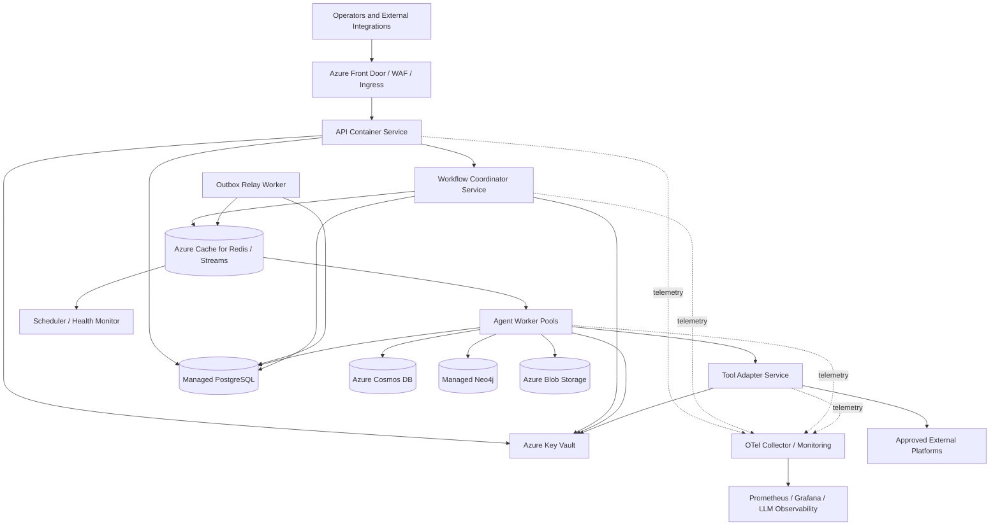
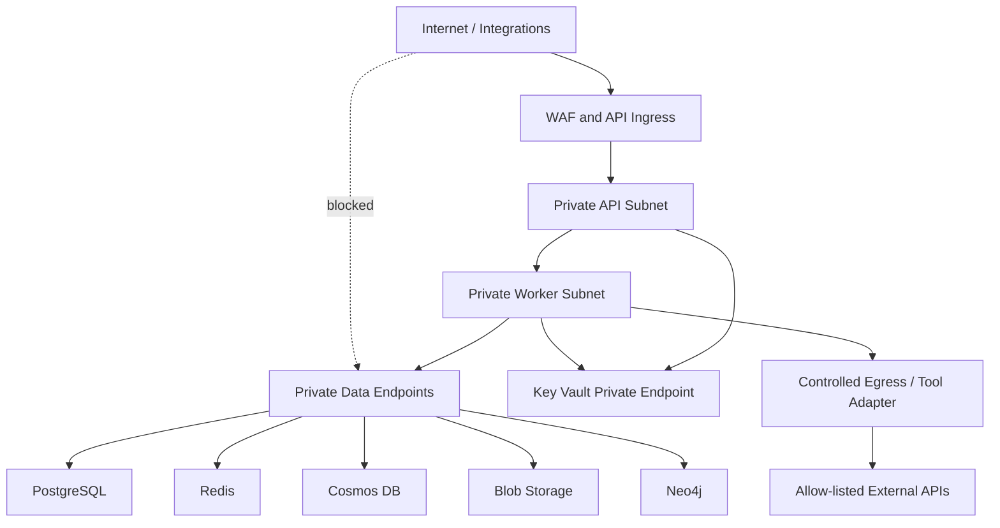

# Deployment Architecture

Version: 1.0  
Status: Design baseline

## Deployment Principles

The platform is deployed as stateless, independently scalable API, worker, scheduler, and relay workloads around managed stateful services. Container images are immutable and promoted unchanged between environments. Workflow correctness does not depend on a particular container instance: current state, checkpoints, idempotency records, and events are durable, so workers can be restarted, scaled, or replaced safely.

The reference cloud target is Azure, with managed identity, private networking, Azure Container Registry, Azure Key Vault, and managed data services. The application remains portable because infrastructure-specific services are accessed through the configuration and adapter boundaries defined in the Low-Level Design.

| Principle | Deployment decision | Rationale |
| --- | --- | --- |
| Reproducibility | Build one immutable image per commit; promote by digest. | Removes environment-specific rebuild drift. |
| Safe asynchronous work | Run API, outbox relay, stream workers, and scheduler as separate workloads. | HTTP requests, background work, and time-based recovery need independent lifecycle/scaling. |
| Least privilege | Use managed identities, Key Vault references, private endpoints, and scoped network egress. | Agents and workers process sensitive operational data and may invoke tools. |
| Observable operations | Every workload exports health, logs, metrics, and traces. | Deployment health is inseparable from workflow reliability. |
| Recovery first | Use managed backups, durable state, restart-safe workers, and tested restore/replay runbooks. | Instances are disposable; state and evidence are not. |

## 1. Deployment Topology

The public entry point accepts only authenticated API and verified webhook traffic. The API validates and durably accepts work, while the workflow coordinator and workers process it asynchronously through Redis Streams. Data services are not publicly reachable. Tool adapters are a separate boundary so egress, credentials, timeout policy, and provider-specific observability are centralized.

## 2. Local Development

Local development prioritizes fast feedback and reproducible dependencies without pretending to be production. Developers run the API and selected worker processes with local configuration, a local Docker Compose dependency stack, and sandboxed or mocked external tools. A developer profile supplies non-production endpoints, low concurrency, short retention, local artifact paths, and verbose-but-redacted telemetry.

| Local capability | Approach | Rationale |
| --- | --- | --- |
| Application processes | Run API, worker, relay, and scheduler independently or through a local process launcher. | Preserves production module boundaries and async behavior. |
| Stateful dependencies | Docker Compose starts PostgreSQL, Redis, Neo4j, and optional local/managed-compatible emulators. | Lets integration tests exercise real protocols without manual setup. |
| External tools/models | Use fake adapters, recorded fixtures, or explicitly selected development credentials. | Prevents accidental production remediation or spend. |
| Secrets | Local uncommitted environment file or developer secret store. | Keeps credentials out of source control and shared logs. |
| Observability | Local OpenTelemetry collector and development dashboard/traces when needed. | Makes correlation and event behavior testable before cloud deployment. |

Local development never shares production data. Sanitized fixtures, synthetic incidents, and redacted document artifacts are used for workflow, retrieval, and evaluation tests.

## 3. Docker and Container Strategy

### Container Image Design

Each deployable component uses the same versioned application image where feasible, with a role-specific entry configuration for API, coordinator, agent worker, outbox relay, scheduler/health monitor, and tool adapter. This keeps dependencies and security patches consistent while allowing independent scale and rollout. If a role develops materially different native dependencies or security posture, it may receive a separate image built from the same verified source and base-image policy.

Images use a minimal pinned runtime base, non-root execution, read-only filesystem where compatible, explicit writable temporary volume, health endpoint, structured log output, and no embedded secrets. Build stages separate dependency resolution from runtime artifacts. An SBOM, image signature/attestation, vulnerability scan result, source revision, build timestamp, and configuration compatibility metadata are attached to the image.

| Workload role | Runtime behavior | Scaling characteristic |
| --- | --- | --- |
| API | Authenticated REST, webhook, SSE control-plane requests. | Scale on request concurrency/latency; keep stateless. |
| Workflow coordinator | State-machine transitions and runtime lifecycle. | Scale on workflow command rate with per-workflow ordering guards. |
| Agent workers | Planner, retrieval, GraphRAG, evaluator, executor, recovery jobs. | Separate pools/concurrency by CPU, model, provider, and risk class. |
| Outbox relay | Publishes committed events to Streams. | Scale on unpublished outbox age/volume; preserve idempotency. |
| Scheduler/health monitor | Delayed retries, deadlines, maintenance, health checks. | Singleton/leased or sharded by deterministic schedule partition. |
| Tool adapter | Approved provider integrations and external side effects. | Scale per provider quota and circuit-breaker state; tightly restrict egress. |

### Docker Compose

Docker Compose is the local multi-container orchestration profile, not the production orchestrator. It defines a reproducible network and service dependencies for development, integration tests, and demos: application roles, PostgreSQL, Redis, Neo4j, optional Cosmos/Blob-compatible emulators or development cloud endpoints, OTel collector, Prometheus, and Grafana.

Compose uses named volumes for disposable local data, health-check dependencies rather than fixed startup sleeps, explicit profiles for optional services, and a dedicated development network. It must never contain production credentials or default to external remediation-capable adapters. Data reset is an intentional developer operation; workflow tests rely on controlled fixtures rather than mutable shared volumes.

## 4. Azure Production Deployment

### Compute and Registry

The initial reference deployment uses Azure Container Apps or an equivalent managed container platform for stateless services and worker pools. It provides revision-based rollout, managed ingress, workload identity, autoscaling, and separation of API/worker roles without operating a Kubernetes control plane. Images are stored in Azure Container Registry (ACR) and deployed by immutable digest.

Azure Container Apps environments are separated by lifecycle tier: development, test/integration, staging, and production. Production uses separate subscriptions or resource groups, identities, Key Vaults, data accounts, and network boundaries from lower environments. A deployment has an explicit environment configuration version and policy/model compatibility record so behavior can be reconstructed later.

| Azure capability | Use in the platform |
| --- | --- |
| Azure Container Registry | Private, signed/scanned image registry; retention and promotion by digest. |
| Azure Container Apps / managed container compute | API, coordinator, workers, relay, scheduler, and tool-adapter revisions with independent autoscaling. |
| Azure Key Vault | Secret and certificate storage, managed identity access, rotation, and audit. |
| Azure Cache for Redis | Streams, cache, locks, rate limiting, retry, and DLQ transport support. |
| Azure Database for PostgreSQL | Transactional workflow/outbox/configuration control state with point-in-time recovery. |
| Azure Cosmos DB | Execution event history, decisions, evaluation reports, and checkpoint snapshots. |
| Azure Blob Storage | Immutable documents, logs, prompts where permitted, and evaluation/tool artifacts. |
| Azure Monitor / Application Insights / OTel Collector | Platform telemetry ingestion and service health integration. |
| Private DNS, Private Link, VNet integration | Private data-plane connectivity and controlled resolution. |

Neo4j may be deployed as an approved managed service or a separately operated private cluster based on availability, data residency, and operational ownership requirements. Its application contract and backup/recovery policy remain unchanged.

### Production Deployment Flow

```mermaid
flowchart LR
    DEV[Developer Pull Request] --> CI[GitHub Actions CI]
    CI --> TEST[Unit, Integration, Contract, Security Tests]
    TEST --> BUILD[Build + SBOM + Sign Image]
    BUILD --> ACR[Azure Container Registry]
    ACR --> STAGE[Staging Deployment by Digest]
    STAGE --> VERIFY[Smoke, Synthetic Workflow, Migration, SLO Checks]
    VERIFY --> APPROVE[Production Approval / Change Control]
    APPROVE --> PROD[Production Revision Rollout]
    PROD --> MON[Metrics, Traces, Alerts, Rollback Gates]
    MON -->|healthy| PROMOTE[Complete Promotion]
    MON -->|regression| ROLLBACK[Rollback to Prior Digest]
```

Deployments use progressive rollout. API revisions can use traffic splitting; worker revisions use controlled consumer-group rollout, bounded concurrency, and compatibility checks so two versions do not produce conflicting state transitions. Database migrations follow expand/contract discipline: additive schema changes are deployed before code that depends on them, backfills are asynchronous and observable, and destructive changes occur only after all supported revisions no longer require the old shape.

## 5. GitHub Actions and CI/CD

GitHub Actions is the reference CI/CD orchestrator. Workflows use OpenID Connect federation to Azure so pipelines receive short-lived scoped credentials rather than stored cloud passwords. Branch protection requires review, status checks, and protected environment approvals for production deployment.

| Pipeline stage | Required checks | Promotion outcome |
| --- | --- | --- |
| Validate | Formatting/linting, typed schema validation, documentation link/diagram validation where supported. | Reject invalid source or contracts early. |
| Test | Unit, integration, contract, workflow, migration, and selected chaos/recovery tests. | Establish behavioral compatibility. |
| Security | Dependency/image scan, SBOM, secret scan, license/policy checks, IaC scan where present. | Prevent vulnerable or non-compliant artifact promotion. |
| Build | Reproducible multi-stage image build; attach commit, SBOM, provenance, signature. | Produce immutable deployable artifact. |
| Publish | Push image by content digest to ACR; record artifact metadata. | Make a verified artifact available for promotion. |
| Deploy staging | Apply infrastructure/application revision with non-production config/identity. | Run production-like verification safely. |
| Verify | Health/readiness, API smoke tests, synthetic workflow, event/outbox/trace propagation, migration and rollback checks. | Demonstrate operational readiness. |
| Deploy production | Manual/environment approval; deploy same digest with production configuration; progressive rollout. | Controlled release with audit trail. |
| Observe/rollback | Monitor SLO/error/cost/queue signals against release baseline; rollback or halt promotion. | Limit blast radius of regression. |

The CI/CD pipeline never prints secrets, downloads arbitrary unpinned build tooling without verification, or rebuilds a different image for production. Infrastructure changes are reviewed, planned, versioned, and applied through the same controlled pipeline.

## 6. Secrets and Environment Variables

### Secrets

Secrets include provider credentials, signing keys, database credentials where managed identity is unavailable, webhook signing material, certificates, and external tool tokens. Azure Key Vault is the production secret authority. Workloads use separate managed identities and receive only the secret references/capabilities required for their role. Secret retrieval and access are audited; rotation is tested and does not require embedding values in images or configuration repositories.

Secrets are not included in container image layers, Docker Compose files, logs, events, traces, error messages, OpenAPI examples, or support exports. Secret scans run in CI and deployment admission. External tool adapters receive credentials at invocation scope where supported; agents receive only logical capabilities, never raw credentials.

### Environment Variables

Environment variables provide non-secret deployment configuration and pointers to managed configuration/secrets. They are typed and validated at startup; a workload fails readiness when critical configuration is missing or incompatible. Typical categories are:

- Environment identity: deployment environment, region, service role, image/version, tenant mode.
- Endpoint references: database host, Redis endpoint, Key Vault URI, OTel collector endpoint, approved integration base URLs.
- Runtime controls: worker concurrency, queue/batch limits, timeout/retry policy reference, feature-flag/configuration version.
- Observability: service name/version, log level, sampling policy reference, metrics exporter endpoint.
- Safety: allowed environments, egress mode, maintenance mode, model/tool routing policy reference.

Feature flags and policy/configuration changes are versioned, audited, and rolled out separately from deployment where possible. A workflow records the effective configuration/policy version used so later replay and incident analysis remain reproducible.

## 7. Networking and Security

The network is segmented into an internet edge, private application tier, private data tier, and controlled egress tier. Only the edge exposes public HTTPS. APIs and webhooks terminate at WAF/ingress with DDoS protection, TLS, request limits, authentication, and signature validation. API, workers, and tool adapters communicate over private service networking; data stores and Key Vault use Private Link/private endpoints and private DNS where supported.

Egress is allow-listed by destination, port, protocol, and workload identity. Tool adapters are the preferred external egress path; they apply provider-specific authentication, request validation, rate limits, circuit breakers, and audit. Administrative APIs, Grafana, and observability backends use separate access paths, strong authentication, and restricted role assignments. Network security does not replace application policy: every tool call is still policy- and approval-governed.

## 8. Scaling

API containers scale on request concurrency, CPU, memory, and latency; they remain stateless. Worker pools scale independently on Redis Stream lag, pending-entry age, queue depth, active workflow count, and provider-specific concurrency budgets. Separate pools prevent expensive model/retrieval work from starving policy, audit, outbox, or recovery processing.

Autoscaling has hard ceilings and backpressure. Increasing worker replicas must not exceed PostgreSQL connection capacity, Redis memory/stream limits, Cosmos provisioned throughput, Neo4j query budget, Blob bandwidth, model quota, or external tool rate limits. Semaphores, per-tenant fairness, admission control, and circuit breakers remain active as the container platform scales. The scheduler/health-monitor role uses a lease or deterministic partitioning to avoid duplicate periodic work.

| Signal | Scales | Guardrail |
| --- | --- | --- |
| HTTP concurrency/p95 latency | API replicas | Protect connection pools and ingress limits. |
| Workflow command lag | Coordinator replicas | Preserve per-workflow ordering and state-version checks. |
| Agent stream lag / queue age | Agent pool replicas | Cap by model/tool/provider quotas and budget. |
| Unpublished outbox age | Relay replicas | Idempotent publication and database throughput limit. |
| Retry/DLQ depth | Recovery/operations workers | Do not turn failure replay into a retry storm. |
| CPU/memory | Compute roles | Diagnose leaks/hot inputs before unbounded scale-out. |

## 9. Monitoring and Health Checks

All deployed workloads expose liveness and readiness endpoints and emit the structured logs, OTel traces, and Prometheus metrics defined in the observability design. Platform health is monitored from the edge through the data and provider dependencies: API availability, deployment revision status, worker heartbeats, stream lag, outbox delay, DLQ age, database/cache capacity, model/tool health, audit completeness, and SLO/error-budget burn.

| Check | Meaning | Deployment behavior |
| --- | --- | --- |
| Liveness | The process event loop and essential process state are responsive. | Restart a failed container; do not make external dependency calls. |
| Readiness | Required configuration, identity, connection capability, and role-critical dependencies meet policy. | Remove from traffic/consumer assignment; return `503` for new work if unsafe. |
| Startup | Migrations/configuration/schema compatibility and initial dependency initialization succeed within a bounded window. | Fail rollout before accepting production traffic. |
| Synthetic workflow | An end-to-end safe, read-only workflow exercises API, outbox, Streams, worker, tracing, audit, and evaluation paths. | Gate promotion and continuously detect integration blind spots. |
| Dependency health | Managed-store/provider health and capability degradation. | Trigger circuit breakers, recovery behavior, or controlled degraded mode. |

Readiness does not require every optional provider to be healthy. It reports degraded capability so the platform can continue safe read-only diagnosis while blocking workflows/actions that require an unavailable critical dependency. A container restart is never used as a substitute for workflow recovery; durable state and events govern resume behavior.

## 10. Backup and Disaster Recovery

Backup and disaster recovery (DR) follow the data-store strategy defined in the database design: PostgreSQL point-in-time recovery, Cosmos backup/restore, Redis operational persistence, Neo4j consistent backups, and Blob versioning/soft-delete/immutability as required. Backup policies include configuration versions, schema/migration history, graph schema, event/stream settings, encryption/key dependencies, and artifact metadata—not only data bytes.

The deployment layer adds application recovery procedures:

- Maintain infrastructure definitions, deployment manifests, image digests, configuration/policy versions, and release audit records in version control and durable artifact storage.
- Restore into an isolated environment first; validate schema compatibility, identity/network configuration, data integrity, outbox state, event sequence, artifact references, and health checks before reopening traffic.
- Rebuild ephemeral compute and Redis consumer groups from immutable image/configuration artifacts and durable workflow/event state; do not treat a container filesystem as recoverable state.
- Reconcile unpublished outbox records, pending stream messages, checkpoints, and external action idempotency status before resuming workers.
- Re-enable automation progressively: read-only/retrieval, then workflow coordination, then policy-gated tool operations after audit and approval checks pass.

RPO/RTO targets are defined by production tier and data classification, recorded in operational policy, and tested through scheduled restore drills. Regional DR uses paired-region data replication/backups and an explicit failover runbook; it does not rely on DNS changes alone. Failover decisions, recovered state, and reconciliation actions are audited.

## 11. Production Deployment Runbook

1. Confirm approved image digest, release notes, migrations, configuration/policy compatibility, dependency capacity, and rollback target.
2. Deploy additive data changes and verify backup/restore and migration health before code requiring them is released.
3. Deploy the same signed image digest to staging with staging identities and configuration; run API, health, event, workflow, audit, and observability synthetic checks.
4. Obtain production environment/change approval. Apply configuration references and deploy a limited production revision.
5. Validate liveness/readiness, traces/logs/metrics, outbox and stream flow, worker heartbeats, SLO baseline, token/cost guardrails, and a safe synthetic workflow.
6. Progress traffic and worker capacity in controlled increments while comparing error rate, latency, workflow completion, event lag, policy/audit integrity, and dependency saturation against pre-release baselines.
7. Halt or roll back to the prior image digest on defined regression gates. Preserve workflow state; drain or reassign consumers rather than abandoning active work.
8. Record deployment annotations, outcome, follow-ups, and any compatibility/debt items in the audit and release records.

## 12. Future Kubernetes Migration

Kubernetes is a planned evolution when workload diversity, scale, multi-region placement, custom scheduling, or platform governance exceeds the managed container platform's operational envelope. The architecture is intentionally migration-ready: every role is a stateless container, runtime configuration is externalized, health endpoints are standardized, workers are stream-driven, and persistent state is managed externally.

| Migration concern | Kubernetes direction | Why it remains compatible |
| --- | --- | --- |
| Compute | AKS Deployments for API/coordinator/relay/tool adapters; Jobs or Deployments for specialized workers. | Roles already have independent images/configuration and lifecycle. |
| Scaling | HPA/KEDA based on CPU, Prometheus, and Redis Stream lag. | Existing queue/backpressure signals map naturally to event-driven autoscaling. |
| Scheduling | Node pools/taints for API, CPU retrieval, model-heavy work, and sensitive tool adapters. | Agent pools already have explicit resource and capability boundaries. |
| Networking | Network policies, ingress controller, workload identity, private endpoints, and egress policies. | The current private-tier/controlled-egress design maps directly. |
| Delivery | GitOps or CI-driven Helm/Kustomize deployment with revision promotion. | Image-digest promotion, probes, and configuration separation are unchanged. |
| Operations | Pod disruption budgets, graceful termination, autoscaler, service mesh only where justified. | Durable checkpoints/idempotency make worker replacement safe. |

The migration should not change workflow semantics. It is validated first with non-production workload replay and synthetic workflows, then staged production worker pools, then API traffic. Kubernetes increases scheduling and operational flexibility; it also adds control-plane responsibility, so it is adopted only when its benefits exceed that operational cost.
