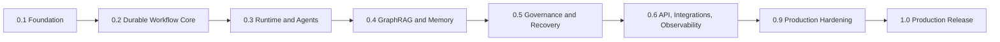

# Product Roadmap: Autonomous AI Operations Platform

Version: 1.0  
Status: Planning baseline

## Roadmap Principles

This roadmap delivers a production software platform incrementally: first establish safe and observable execution foundations, then add autonomous diagnosis and governed action, then validate reliability under realistic operational load before declaring Version 1.0. Each milestone produces a usable, releasable increment rather than a collection of incomplete subsystems.

Durations are planning estimates for one cross-functional delivery team and exclude prolonged external procurement, data-access approval, or major provider outages. Milestone exit criteria—not calendar dates—determine promotion. Work may run in parallel only when it does not weaken the dependency order shown below.

## Milestone 0.1 — Engineering Foundation

- **Goal:** Establish a repeatable, secure, observable engineering baseline on which all runtime capabilities can be developed and tested.
- **Features:** Repository conventions; typed configuration; dependency-injection composition root; container strategy; local Docker Compose profile; environment separation; baseline CI; structured logging and correlation context.
- **Deliverables:** Project skeleton and module boundaries; local developer onboarding guide; container image definition; Compose dependency stack; CI workflow; configuration/secret policy; initial architecture documentation.
- **Tests:** Unit-test harness; lint/type/schema validation; configuration validation; container build verification; local service health checks; secret-scanning baseline.
- **Documentation:** Developer setup, contribution guide, configuration reference, architecture decision records, local troubleshooting, and initial operations glossary.
- **GitHub Release:** `v0.1.0-foundation` pre-release with verified local bootstrap instructions and known limitations.
- **Risks:** Premature coupling to frameworks, inconsistent environment configuration, accidental secret exposure, and development tooling that diverges from production constraints.
- **Expected Duration:** 2–3 weeks.

## Milestone 0.2 — Durable Workflow and Event Core

- **Goal:** Deliver reliable asynchronous workflow lifecycle management with durable state, idempotent event handling, and operational recovery primitives.
- **Features:** Workflow aggregate/state machine; PostgreSQL repositories and transactional outbox; Redis Streams producer/consumer groups; common event envelope; idempotency ledger; retry queue; dead-letter queue; scheduler and checkpoint contracts.
- **Deliverables:** WorkflowService and EventService contracts; versioned event catalogue; persistence schema/migration plan; outbox relay design; retry/DLQ operations view; baseline workflow timeline API model.
- **Tests:** Transaction and optimistic-concurrency tests; duplicate-delivery tests; outbox failure/replay tests; pending-message claim tests; retry/backoff and DLQ routing tests; cancellation/deadline state-transition tests.
- **Documentation:** Event architecture, database design, workflow state-transition reference, replay/DLQ runbook, and data-retention policy.
- **GitHub Release:** `v0.2.0-workflow-core` pre-release demonstrating a durable, no-op workflow from creation through terminal state and replay.
- **Risks:** Dual-write gaps, unsafe retry semantics, ordering assumptions across workflows, unbounded stream retention, and workflow state changes without audit/event evidence.
- **Expected Duration:** 3–4 weeks.

## Milestone 0.3 — Runtime Abstraction and Agent Execution

- **Goal:** Introduce a framework-neutral workflow runtime and bounded agent execution without binding business logic to a graph engine.
- **Features:** `WorkflowRuntime` contract; runtime factory/registry; LangGraph runtime adapter; execution context and checkpoints; Planner, Retriever, Executor, and Workflow Coordinator roles; Supervisor budgets/cancellation; typed tool-adapter contracts.
- **Deliverables:** Runtime compatibility matrix; deterministic test runtime; agent contracts and capability manifests; execution lifecycle model; safe read-only demonstration workflow; tool-operation schema catalogue.
- **Tests:** Runtime contract suite run against the deterministic and LangGraph implementations; task cancellation/deadline tests; agent input/output schema tests; checkpoint/resume tests; concurrency/semaphore tests; tool idempotency tests with fake adapters.
- **Documentation:** Low-Level Design runtime section, agent design, runtime selection guide, execution context contract, tool-adapter safety guide, and agent failure taxonomy.
- **GitHub Release:** `v0.3.0-runtime-agents` pre-release with a repeatable read-only incident investigation workflow.
- **Risks:** LangGraph concepts leaking into services, runaway agent loops, unbounded model/tool costs, hidden mutable state, and unsafe direct tool access.
- **Expected Duration:** 3–4 weeks.

## Milestone 0.4 — GraphRAG, Retrieval, and Governed Memory

- **Goal:** Provide evidence-grounded diagnosis using documents, operational topology, prior incidents, and bounded memory.
- **Features:** Document/artifact ingestion; Blob Storage provenance; Neo4j topology and incident graph; GraphRAG traversal policy; retrieval ranking/freshness; workflow-scoped memory; memory retention/redaction; cache invalidation on graph changes.
- **Deliverables:** Knowledge ingestion pipeline design; Neo4j schema and traversal catalogue; retrieval evidence manifest; source provenance model; memory policy; sample sanitized knowledge corpus and AI SRE retrieval scenarios.
- **Tests:** Retrieval relevance/coverage evaluation set; graph traversal depth/tenant-scope tests; stale-document and source-conflict tests; provenance completeness tests; memory isolation/retention tests; cache invalidation tests.
- **Documentation:** GraphRAG schema, ingestion/source requirements, retrieval API/contract, memory lifecycle policy, data classification, and knowledge-quality runbook.
- **GitHub Release:** `v0.4.0-knowledge` pre-release with evidence-cited diagnosis for representative incidents.
- **Risks:** Stale or low-quality knowledge causing misleading plans, data-access leakage across scopes, prompt-injection content in documents, graph cardinality/cost growth, and unsupported confidence claims.
- **Expected Duration:** 3–5 weeks.

## Milestone 0.5 — Governance, Evaluation, and Recovery

- **Goal:** Make autonomous actions safe, explainable, evaluable, and recoverable before enabling any production-impacting remediation.
- **Features:** Policy engine integration; risk classification; human approval lifecycle; Audit Agent; Evaluation Agent/reporting; Recovery Agent; compensation/retry/escalation paths; Notification Agent; policy-gated Executor; action verification.
- **Deliverables:** Policy/approval decision model; action capability allow-list; audit record specification; evaluation definitions and reports; recovery runbooks; notification routing policy; first approved low-risk remediation scenario in a sandbox.
- **Tests:** Allow/deny/approval-required policy tests; approval expiry and authority tests; audit completeness/integrity tests; action verification and indeterminate-outcome tests; compensation/recovery-loop tests; evaluator calibration and false-success tests.
- **Documentation:** Policy reference, human-approval guide, tool authorization matrix, audit/export guide, evaluation methodology, recovery/compensation runbooks, and security threat model update.
- **GitHub Release:** `v0.5.0-governed-autonomy` pre-release with policy-gated sandbox remediation and complete audit trail.
- **Risks:** Policy bypass through an alternate path, approvals that are not rechecked at execution, audit gaps, false-positive evaluation, non-idempotent remediation, and recovery that repeats harmful actions.
- **Expected Duration:** 4–5 weeks.

## Milestone 0.6 — API, Integrations, and Operational Observability

- **Goal:** Expose a stable production control plane and make platform behavior measurable, diagnosable, and supportable end to end.
- **Features:** Versioned REST API; OAuth/OIDC authentication and scoped authorization; workflow/execution/evaluation/audit endpoints; webhooks; SSE updates; integration adapters for alerts, telemetry, deployment history, and notifications; OpenTelemetry; Prometheus/Grafana; Phoenix/LangSmith adapters; SLI/SLO/error-budget reporting.
- **Deliverables:** OpenAPI v1 contract; webhook signing/retry policy; API client examples using synthetic data; dashboards for platform, workflow, event, agent, evaluation, cost, and governance; alert rules and on-call runbooks; incident timeline and governed replay view.
- **Tests:** API authentication/authorization and non-enumeration tests; OpenAPI contract tests; webhook signature/replay tests; SSE reconnection/authorization tests; trace propagation through Streams; dashboard/alert synthetic checks; load tests for API and stream consumers.
- **Documentation:** REST API design, integration onboarding, webhook guide, observability design, dashboard catalogue, alert response runbooks, SLO policy, and support escalation guide.
- **GitHub Release:** `v0.6.0-operable-platform` pre-release with production-like API, telemetry, and integration demonstration environment.
- **Risks:** API contract drift, excessive metric cardinality, observability blind spots, external integration rate limits, insecure webhook handling, and LLM data exported beyond approved boundaries.
- **Expected Duration:** 4–5 weeks.

## Milestone 0.9 — Production Hardening and Release Candidate

- **Goal:** Prove the integrated platform meets agreed reliability, security, performance, cost, and operational readiness gates under production-like conditions.
- **Features:** Azure production topology; GitHub Actions CI/CD with signed images and OIDC; Key Vault/managed identities; private networking; autoscaling/backpressure; backup and restore; disaster-recovery procedures; load/chaos testing; reliability score; release governance.
- **Deliverables:** Staging and production infrastructure definitions; progressive rollout/rollback procedure; capacity plan; threat model and security review evidence; backup/restore drill report; DR runbook; release-candidate scorecard; known-issues register and support model.
- **Tests:** End-to-end synthetic workflows; production-like load and soak tests; worker loss, Redis lag, database/provider outage, DLQ, and recovery chaos tests; restore/reconciliation tests; failover tabletop; penetration/security scans; cost-budget tests; rollback exercise.
- **Documentation:** Deployment architecture, production runbook, backup/DR runbooks, SRE handover guide, capacity and cost guide, incident response guide, and release checklist.
- **GitHub Release:** `v0.9.0-rc.1` release candidate, followed by additional `rc` tags only for verified critical fixes; release notes list validated capabilities and explicit non-goals.
- **Risks:** Hidden cross-store consistency failures, external-provider reliability, operational readiness gaps, insufficient evaluation data, scale-induced cost escalation, and release pressure causing safety gates to be waived.
- **Expected Duration:** 4–6 weeks.

## Milestone 1.0 — Production Release

- **Goal:** Release a production-ready autonomous AI operations platform whose AI SRE reference workflow can detect, diagnose, evaluate, and safely recover supported incident classes with human governance and full auditability.
- **Features:** Stable v1 control plane; durable event-driven runtime; framework-isolated workflow execution; GraphRAG and governed memory; planner/retriever/executor/evaluator/recovery/policy/audit/operational agents; human approval; typed integrations; production observability; secure Azure deployment; documented backup/DR and controlled scaling.
- **Deliverables:** Approved production deployment; signed immutable release artifact; finalized SLOs and reliability score baseline; supported workflow and tool capability catalogue; operational dashboards/alerts; support and incident-response ownership; completed security, privacy, and readiness sign-offs.
- **Tests:** All preceding automated suites passing; release-candidate regression suite; representative incident evaluation suite; SLO conformance window; successful restore/replay drill; no unresolved critical security findings; verified audit completeness for consequential actions; final production smoke workflow.
- **Documentation:** Published PRD, HLD, LLD, database, events, agents, API, observability, deployment, operations runbooks, API/OpenAPI reference, release notes, compatibility policy, and known limitations.
- **GitHub Release:** `v1.0.0` stable release with signed tag, release notes, artifact digests, migration/upgrade notes, security advisory process, and support/rollback guidance.
- **Risks:** Premature general availability before SLO evidence exists, overclaiming autonomy outside validated incident classes, unreviewed policy/tool expansion, unsupported production integrations, and deferred operational ownership.
- **Expected Duration:** 2–3 weeks for final verification, approvals, and controlled general-availability rollout after the release candidate is accepted.

## Version 1.0 Release Gate

Version 1.0 is complete only when the release candidate has met its functional, quality, safety, and operational gates. The acceptance decision is evidence-based:

| Gate | Required evidence |
| --- | --- |
| Functional | Supported AI SRE workflows complete through diagnosis, governed action where permitted, evaluation, recovery, and audit. |
| Reliability | Agreed SLO window, workflow success/recovery targets, queue/retry/DLQ health, and restored-state reconciliation results. |
| Safety and security | Policy and approval enforcement, least-privilege tool access, audit completeness, secret/network controls, and no unresolved critical findings. |
| Observability | Correlated logs/traces/events, dashboards, actionable alerts, Phoenix/LangSmith controls, incident timeline, and replay validation. |
| Operability | On-call ownership, runbooks, backup/restore and DR drill evidence, capacity/cost controls, and tested rollback. |
| Documentation | Current architecture/API/operations documentation, release notes, limitations, and support handoff. |

The roadmap ends at **Version 1.0**. Post-1.0 work—multi-tenancy expansion, multi-region active operation, plugin marketplace, Agent SDK, Kubernetes migration, model routing, and adaptive planning—enters a separately prioritized roadmap and must preserve the Version 1.0 safety, audit, and reliability invariants.
