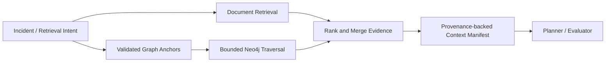

# GraphRAG Design

## Purpose

GraphRAG grounds operational reasoning in both documents and service relationships. It enriches an incident with affected services, dependencies, owners, deployments, symptoms, prior incidents, and approved runbooks while preserving source provenance.

## Retrieval Flow

## Data Model and Rules

Key nodes are Service, Component, Dependency, Deployment, Incident, Symptom, Runbook, Document, and Team. Relationships include `DEPENDS_ON`, `AFFECTED`, `OBSERVED`, `DEPLOYED_AS`, `HAS_RUNBOOK`, `DOCUMENTS`, and `OWNED_BY`. Retrieval starts with an evidence-backed anchor, allows only configured relationship types, applies tenant/environment/access filters before traversal, and limits depth and result count.

Graph queries are parameterized repository templates; agents do not generate Cypher. Results include path, source, freshness, confidence, graph-schema version, and access decision. Missing or stale graph data produces an explicit coverage gap and falls back to document retrieval; it never becomes an unsupported root-cause claim.

## Ingestion and Quality

Ingestion validates source authority, schema, ownership, and provenance. Changes emit `GraphUpdated` and invalidate affected caches. Graph quality is measured by anchor resolution, freshness, traversal latency, relevant path coverage, and downstream diagnosis value. Curated relationships and generated similarity links are clearly distinguished.
