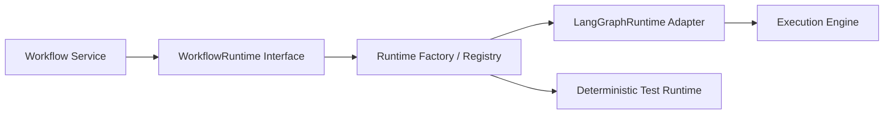

# Workflow Runtime Design

## Purpose

The `runtime` module owns execution-engine concerns while keeping workflow business logic framework-neutral. Services depend on the internal `WorkflowRuntime` contract, never directly on LangGraph.

## Contract

`WorkflowRuntime` starts, resumes, inspects, checkpoints, cancels, and terminates a declarative workflow using an `ExecutionContext`. The context carries workflow, execution, and correlation IDs; actor and tenant scope; deadline; cancellation signal; approved capabilities; configuration/policy snapshot; and trace context.

## LangGraph Adapter

`LangGraphRuntime` translates a platform workflow definition and execution context into engine-specific graph invocation, checkpoint, interrupt, and result semantics. It normalizes engine failures into platform exceptions and has no policy, repository, API, or direct tool-authority logic.

## Lifecycle and Safety

Runtime operations are asynchronous and bounded by deadlines, cancellation, concurrency, and checkpoint policy. State transitions are owned by WorkflowService; side effects require policy-gated Executor operations. A registry/factory resolves runtime implementations from typed configuration, enabling deterministic tests and future engine replacement without changing service contracts.
