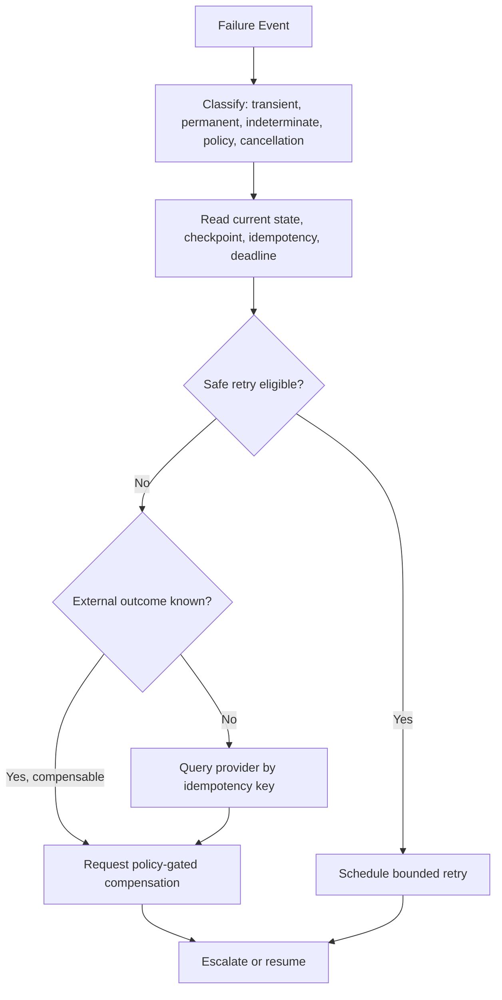

# Recovery Engine Design

## Purpose

The Recovery Engine converts failure into explicit, audited workflow behavior. It classifies typed failures and selects retry, status verification, compensation, pause, or escalation without rewriting evidence or blindly repeating side effects.

## Decision Flow

## Controls

- Recovery begins from a durable failure event and current workflow state, never solely from a log line.
- Retries require transient classification, remaining deadline/budget, and idempotency safety; use exponential backoff and jitter.
- Indeterminate external side effects are verified by provider reference before any repeat or compensation.
- Recovery detects repeated fingerprints and stops loops; terminal escalation includes checkpoint, evidence, policy state, and audit trail.
- Every attempt emits `RecoveryStarted` and `RecoveryCompleted` and is evaluated for outcome and safety.

## Metrics

Track recovery success, time to recovery, retry exhaustion, compensation success, escalation rate, loop suppression, and unreconciled external outcomes. Recovery runbooks are exercised with chaos and restore tests.
